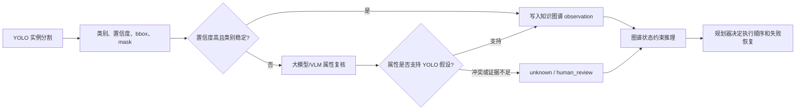

# 当前 YOLO 模型训练结果图文说明

> 作用：用一份可读说明，把当前建筑废弃物 YOLO 实例分割模型的训练、测试、模型选择和大模型复核位置讲清楚。本文档不启动训练，只整理已有训练产物和评估产物。

## 1. 当前结论

当前项目已经完成 11 类建筑废弃物实例分割模型的训练与独立 test split 对比。综合掩膜质量、推理耗时和后续知识图谱/机器人任务规划需求，当前推荐：

| 用途 | 推荐模型 | 原因 |
|---|---|---|
| 主线感知模型 | YOLO11s-seg 50 epoch | Mask mAP50-95 当前最高，推理耗时低，适合后续接入知识图谱与 ROS2 原型。 |
| 轻量基线 | YOLO11n-seg 50/100 epoch | 速度快、参数量小，用于对比和低资源验证。 |
| 高容量对比 | YOLOv9c-seg 50 epoch | Box mAP50-95 最高，但推理耗时明显更高；更适合作为上限对照，不作为当前默认主模型。 |

需要特别区分：YOLO 只负责输出二维视觉证据，包括类别、置信度、bbox 和 mask；它不直接决定是否抓取、先抓哪个、失败后怎么办。

## 2. 数据和类别范围

当前训练和测试口径为：

```text
数据视图：datasets/waste11_grouped_v1/data.yaml
任务类型：instance segmentation
测试集：890 张图像
测试有效实例：19,475 个
类别数：11 个明确视觉类别
```

11 个明确视觉类别：

```text
concrete, brick, tile, wood, gypsum_board, foam,
metal, soft_plastic, hard_plastic, paperboard, glass
```

`unknown` 不是 YOLO 训练类别。它是系统在低置信度、证据冲突、风险不明或需要人工复核时生成的图谱/任务状态。

## 3. 训练曲线怎么看

下图是当前推荐主模型 YOLO11s-seg 50 epoch 的训练结果图。它来自 Ultralytics 自动生成的 `results.png`，用于观察训练损失、验证损失和验证指标随 epoch 的变化。


关键读法：

- `train/box_loss`、`train/seg_loss`、`train/cls_loss` 下降，说明模型在学习检测框、掩膜和类别判别。
- `metrics/mAP50(M)` 与 `metrics/mAP50-95(M)` 是 mask 指标，和后续对象轮廓裁剪、RGB-D 点云提取更相关。
- 训练曲线只能说明 validation 表现，不能替代独立 test 结果。

## 4. 独立 test 对比结果

四个候选模型都在同一 test split 上做过评估，结果如下：

| 模型 | Box mAP50-95 | Mask mAP50 | Mask mAP50-95 | Mask P | Mask R | 推理耗时/ms | 定位 |
|---|---:|---:|---:|---:|---:|---:|---|
| YOLO11n-seg 50e | 0.8437 | 0.9363 | 0.7397 | 0.9428 | 0.8908 | 5.24 | 轻量基线 |
| YOLO11n-seg 100e | 0.8528 | 0.9411 | 0.7493 | 0.9524 | 0.8946 | 5.17 | 轻量模型延长训练 |
| YOLO11s-seg 50e | 0.8736 | 0.9476 | 0.7651 | 0.9483 | 0.9053 | 5.45 | 当前推荐主模型 |
| YOLOv9c-seg 50e | 0.8837 | 0.9469 | 0.7645 | 0.9485 | 0.9077 | 14.09 | 高容量对比模型 |

结论不是“最大模型一定最好”。YOLOv9c 的 box 指标略高，但 YOLO11s 的 mask mAP50-95 略高，并且推理耗时明显更低。对于后续知识图谱和机器人任务状态构建，mask 质量和运行成本比单纯 box 指标更重要。

## 5. 主模型的可视化结果

下面这些图来自 YOLO11s-seg 的独立 test 评估输出。

### 5.1 标注与预测对照

左图是 test batch 的标注，右图是模型预测。它适合快速查看模型是否能在复杂图像中找到实例、类别和掩膜。

| 标注 | 预测 |
|---|---|
|  |  |
|  |  |

### 5.2 Mask PR 曲线

PR 曲线用于查看不同置信度阈值下 precision 和 recall 的平衡。对本项目来说，它可以帮助设置什么时候直接接收 YOLO 结果，什么时候触发大模型复核或人工复核。


### 5.3 归一化混淆矩阵

混淆矩阵用于查看类别之间的误判关系。后续如果要设计大模型复核规则，应优先关注容易混淆、且会影响分拣策略的类别。


## 6. 类别级结果与风险解释

YOLO11s-seg 的类别级 mask 表现如下：

| 类别 | test 实例数 | Mask mAP50 | Mask mAP50-95 | 解读 |
|---|---:|---:|---:|---|
| concrete | 6,893 | 0.9735 | 0.7598 | 数量多、总体稳定，但碎片形态复杂，抓取前仍需 RGB-D 几何验证。 |
| brick | 257 | 0.9903 | 0.8530 | 表现较好，可作为自动候选对象之一。 |
| tile | 235 | 0.9808 | 0.8363 | 表现较好，但薄片姿态仍依赖深度信息。 |
| wood | 2,205 | 0.9455 | 0.7742 | 可用，长条和遮挡会影响后续抓取姿态。 |
| gypsum_board | 218 | 0.9412 | 0.8417 | 视觉分割较好，但处理策略仍要结合粉尘和破碎风险。 |
| foam | 142 | 0.9477 | 0.8783 | 当前 mask 指标较好，但实例数较少，不能过度外推。 |
| metal | 3,666 | 0.9170 | 0.5669 | 严格 mask 边界较弱，复杂金属结构需要重点复核。 |
| soft_plastic | 872 | 0.8764 | 0.6744 | 材质混淆风险较高，建议更频繁触发大模型或人工复核。 |
| hard_plastic | 3,594 | 0.9527 | 0.7235 | 类别识别可用，但边界精度中等。 |
| paperboard | 980 | 0.9136 | 0.7730 | 可用，受污染、折叠、遮挡会影响策略判断。 |
| glass | 413 | 0.9848 | 0.7353 | 视觉识别较好，但安全风险高，不能仅凭高置信度自动抓取。 |

最需要保守处理的是 `metal`、`soft_plastic` 和 `glass`：前两者主要是视觉边界或材质混淆问题，`glass` 则是风险属性问题。

## 7. 大模型在这里做什么

当前大模型不参与 YOLO 训练，也不改写 test 指标。它应该放在 YOLO 后面，作为结构化复核器，而不是替代 YOLO 的检测器。

推荐链路：



大模型适合做：

- 对低置信度实例提取结构化视觉属性；
- 判断材质、形态、破碎程度等属性是否支持 YOLO 类别；
- 标记证据冲突、疑似危险、需要人工复核的对象；
- 为知识图谱写入可审计的复核理由。

大模型不应该做：

- 不经过 YOLO，直接自由回答整张图有哪些垃圾；
- 直接决定机械臂抓取动作；
- 把不确定对象强行改成某个训练类别；
- 把 `unknown` 当作 YOLO 训练类别。

## 8. 与知识图谱和规划器的关系

当前系统应保持属性、状态与规划三层分工：

```text
KG graph_state：提供类别先验、当前实例状态和可行性；规划优先级由行动规划智能体动态计算
KG graph_state 状态谓词：表示现在能不能做
行动规划智能体：决定先做什么、后做什么、失败后怎么办
```

YOLO 输出只进入“图谱状态”的感知证据部分，例如：

```text
class_name, confidence, bbox, mask, image_id, timestamp
```

随后知识图谱再结合长期知识和短期状态生成：

```text
visible, reachable, graspable, risk_level,
requires_review, blocked_by, can_attempt_now
```

因此，不能把 `mAP 高` 写成 `机器人可以自动完成分拣`。更准确的表述是：当前 YOLO 模型可以为动态知识图谱提供对象级二维视觉输入，后续是否执行要由图谱状态约束和规划器共同决定。

## 9. 文件位置

主模型训练产物：

```text
outputs/yolo_runs/paper_e1/yolo11s_seg_waste11_grouped_e50_v1
```

主模型 test 评估产物：

```text
artifacts/model_comparison_test/yolo11s_e50
```

高容量对比模型 test 评估产物：

```text
artifacts/model_comparison_test/yolov9c_e50
```

更详细的中间记录：

```text
datasets/docs/training_records/yolo_model_comparison_test_results_zh.md
paper_experiments/docs/e1_yolo11n_waste11_test_result_zh.md
```

注意：`outputs/` 和部分 `artifacts/` 可能属于本地生成产物，若在 GitHub 网页上查看，图片可能不会显示；在本机工作区打开本文档时可以正常引用。

## 10. 下一步建议

1. 固定 YOLO11s-seg 作为当前主线感知模型，保留 YOLOv9c 作为论文对比模型。
2. 针对 `metal`、`soft_plastic`、`glass` 设置更保守的大模型复核和人工复核策略。
3. 接 RealSense 后，用 mask 区域提取点云，再评估深度噪声、可抓取点和遮挡状态。
4. 后续如需继续训练，只输出训练命令和参数建议；实际训练由用户在本机显式检查显存后运行。
