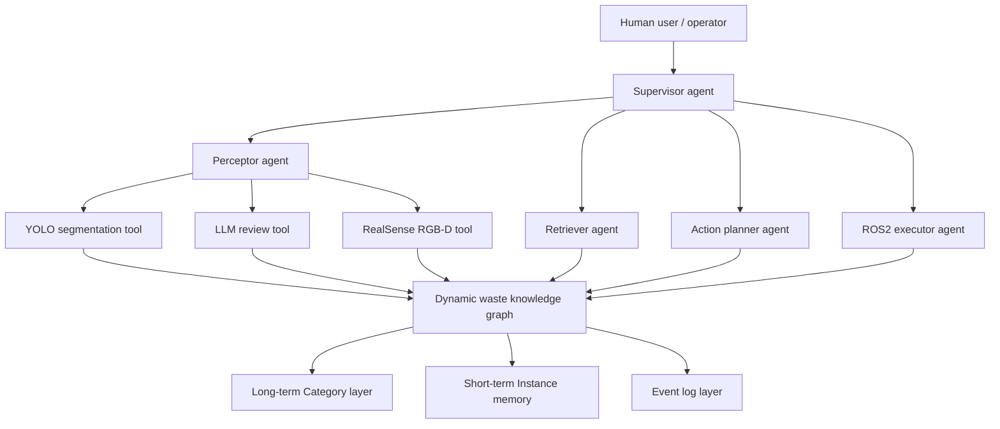
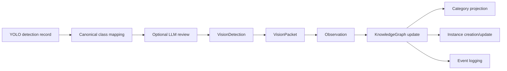

# 面向复杂动态建筑废弃物环境的人机协同自治决策：融合实例分割、大模型复核与动态知识图谱的多智能体框架

> 期刊论文草稿版本。本文参考了“LLM-informed multi-agent AI system for drone-based visual inspection for infrastructure”的论文组织方式，但研究对象、系统任务、数据结构和实验内容均围绕本项目重新组织。  
> 目标期刊方向可考虑：Automation in Construction、Advanced Engineering Informatics、Journal of Building Engineering、Engineering, Construction and Architectural Management 等。

---

## 摘要

复杂建筑拆除、装修和改造场景中的废弃物分拣任务具有显著的非结构化和动态性特征。目标物体类别多样、形态不规则、堆叠遮挡频繁，且部分对象可能具有易碎、尖锐、粉尘污染或疑似石棉等安全风险。现有基于视觉识别的废弃物分拣方法多聚焦于单帧分类或检测结果，难以进一步支持可追踪状态表示、人机协同复核和机械臂任务规划。为此，本文提出一种融合实例分割、大模型复核与动态知识图谱的多智能体决策框架，用于复杂动态建筑废弃物环境中的危险废弃物认知与人机协同自治决策。

该框架由三类核心组件组成：感知工具层、多智能体决策层和动态知识图谱世界模型。首先，采用 YOLO11n-seg 对建筑废弃物图像进行实例分割，输出目标类别、置信度、边界框和分割掩膜。其次，引入基于 OpenAI-compatible 接口的大模型复核器，对低置信度和高风险类别进行保守复核，并将复核结果限制在预定义废弃物类别体系内，以降低模型幻觉对任务规划的影响。再次，构建“长期知识层 - 短期记忆层 - 事件日志层”组成的动态知识图谱，其中长期知识层存储稳定类别语义和处理先验，短期记忆层存储当前场景对象实例、空间状态和抓取相关属性，事件日志层记录观测、复核、更新和执行反馈。该图谱进一步为 LangGraph 多智能体规划和 ROS2 机械臂执行提供结构化状态接口。

基于融合后的 12 类建筑废弃物数据集，本文训练了 YOLO11n-seg 实例分割模型。阶段性实验结果表明，模型在验证集上取得 box mAP50 为 0.8031、box mAP50-95 为 0.6898、mask mAP50 为 0.7959、mask mAP50-95 为 0.6017 的性能。单图原型实验进一步验证了 YOLO、大模型复核和知识图谱构建链路的可运行性。结果表明，所提出框架能够将视觉识别结果转化为可解释、可追踪、可规划的动态世界状态，为后续 RealSense RGB-D 三维定位、空间关系推断和机械臂闭环抓取提供基础。

**关键词：** 建筑废弃物；危险废弃物；知识图谱；大语言模型；多智能体系统；实例分割；人机协同；机器人分拣

---

## 1. 引言

建筑拆除、装修和改造活动会产生大量异质废弃物，包括混凝土、砖块、木材、石膏板、金属、塑料、纸板、玻璃以及潜在危险板材等。与规则工业分拣场景不同，建筑废弃物通常存在形态不规则、尺度差异大、堆叠遮挡严重、局部污染和材料混杂等问题。这使得基于机械臂的自动化分拣不仅需要“看见目标”，还需要理解目标状态、处理风险、空间依赖关系以及人工介入需求。

近年来，深度学习目标检测和实例分割模型已被广泛用于建筑垃圾识别。此类方法能够从图像中检测废弃物类别和位置，但其输出通常停留在单帧视觉层面。例如，一个分割模型可以识别“砖块”或“硬塑料”，但不能直接回答该物体是否可由夹爪抓取、是否被其他物体阻塞、是否需要人工复核、或者机械臂完成一次操作后场景状态如何更新。对于人机协同自治决策而言，单帧视觉识别结果需要进一步组织为可追踪、可推理、可规划的状态表示。

与此类似，近期基础设施巡检领域的 LLM 多智能体研究表明，将大语言模型、多智能体系统、工具调用和三维场景图结合，可以增强系统在任务分解、空间语义检索和人机交互中的灵活性。该类研究通常将系统划分为 agent layer、toolkit layer 和 scene graph 或 knowledge graph layer，使不同智能体通过工具和图结构共享状态。受这一范式启发，本文将动态知识图谱引入建筑废弃物分拣任务，将其作为多智能体系统和机器人执行层之间的共享世界模型。

然而，建筑废弃物分拣与基础设施巡检仍存在明显差异。基础设施巡检通常关注结构构件、损伤识别和路径规划，而建筑废弃物分拣更关注对象级材料类别、夹爪可处理性、风险控制、空间阻塞关系和执行后状态演化。因此，本文不直接采用传统静态场景图，而是提出面向废弃物处理任务的双层动态知识图谱，将稳定类别知识、当前实例状态和事件演化过程分离表达。

本文的主要贡献包括：

1. 提出一种面向复杂建筑废弃物环境的人机协同自治决策框架，将实例分割、大模型复核、动态知识图谱和多智能体规划接口集成为统一方法链路。
2. 构建面向任务规划的双层动态知识图谱，将长期类别语义、短期实例状态和事件日志分层组织，为机械臂抓取和人工复核提供可解释状态基础。
3. 建立 YOLO11n-seg 到知识图谱的结构化接口，使类别、置信度、边界框、掩膜和后续 RGB-D 几何字段能够被转化为图谱实例节点。
4. 引入保守大模型复核机制，对低置信度和高风险类别进行约束式复核，并通过类别白名单和人工复核标记降低大模型幻觉风险。
5. 在融合建筑废弃物数据集上完成实例分割模型训练，并通过单图原型验证 YOLO-LLM-KG 链路的可运行性。

---

## 2. 相关研究与研究缺口

### 2.1 建筑废弃物视觉识别

建筑废弃物识别研究通常采用目标检测、语义分割或实例分割模型，从 RGB 图像中识别混凝土、砖块、木材、金属、塑料等类别。目标检测方法具有推理速度快、部署成本低的优势，但边界框难以准确表达不规则废弃物轮廓。语义分割可生成像素级类别区域，但不一定区分同类多个实例。实例分割能够同时提供对象级类别、位置和轮廓，更适合机器人抓取任务中的单体对象建模。

尽管如此，视觉模型输出本身仍不是任务规划状态。对于机械臂抓取而言，系统还需要了解物体是否可抓取、是否易碎、是否具有污染风险、是否需要人工复核、以及是否被其他物体阻塞。因此，废弃物视觉识别需要与知识表示和任务决策机制结合。

### 2.2 大模型与多智能体系统

大语言模型的发展使其从单一文本生成工具逐渐转向能够参与工具调用、任务分解和人机交互的智能体组件。在多智能体系统中，不同智能体可以承担路由、检索、感知、规划和执行等专门职责，并通过共享状态或知识库完成复杂任务链。基础设施巡检领域已有研究将 LLM 智能体、工具集和 3D Scene Graph 结合，用于无人机路径规划、结构信息检索和视觉检查任务。

该范式对本文具有直接启发：建筑废弃物处理同样需要多模块协同，包括感知、检索、规划、执行和人工审查。但与基础设施巡检不同，本研究中的空间图结构不仅需要表达静态构件关系，还必须表达操作后动态变化、风险控制和夹爪处理约束。

### 2.3 知识图谱与机器人任务规划

知识图谱能够以节点、边和属性形式组织对象、语义、空间关系和历史事件。在机器人任务规划中，知识图谱可作为可查询世界模型，使规划器能够根据对象类别、状态、关系和约束生成行动方案。对于建筑废弃物场景，图谱的价值不在于静态存储识别结果，而在于持续维护“当前可操作状态”。

现有研究缺口主要包括：

- 单帧视觉识别与机器人任务规划之间缺少稳定状态中介；
- 大模型复核常缺乏类别约束和风险保守机制；
- 建筑废弃物图谱往往缺少短期状态、事件演化和执行反馈；
- 视觉、知识图谱、多智能体和 ROS2 执行层之间缺少清晰接口。

本文针对上述缺口提出面向人机协同自治决策的动态知识图谱框架。

---

### 2.4 从感知到执行的系统性缺口

现有 C&D 废弃物智能分拣研究已经在目标检测、语义分割、实例分割和抓取候选生成等方面取得进展，但从感知到物理执行的完整闭环仍然不足。该不足并不只是“缺少一个机械臂控制模块”，而是缺少将实时感知结果持续转化为可追踪知识状态、可审计任务计划和可验证执行反馈的中间机制。

第一，**从感知到执行仍然存在状态断裂**。视觉模型通常以单帧类别、边界框或分割掩膜形式输出结果；机器人控制器则需要目标位姿、可抓取性、风险约束、优先级和前置依赖等任务变量。若两者之间缺少持续更新的世界模型，机械臂容易基于过期场景信息执行动作，且无法解释某个目标为何被选择、为何被拒绝或为何需要人工确认。

第二，**现有知识图谱多停留在静态知识库层面**。已有研究表明，知识图谱与大语言模型结合能够支持施工风险感知、知识检索和规则推理。然而，建筑废弃物堆体是动态变化的物理环境：对象会因抓取、滑落、遮挡、抓取失败或人工干预而改变位置与关系。因此，图谱不仅应保存类别语义，还必须记录对象实例状态、空间依赖、执行后变化和状态变化原因。

第三，**多智能体机制与实体机器人之间的耦合仍不充分**。KARMA、AGENTiGraph、RCTAMP 等多智能体知识维护或规划协商框架表明，角色分工和共享记忆可提高复杂任务的推理能力。然而，面向建筑废弃物物理分拣的研究仍需明确感知、规划、安全审计、执行和人机协同之间的职责边界，并在真实或仿真分拣单元中验证任务执行与故障恢复效果。正式投稿前，应补齐上述框架的准确书目信息和引用编号。

基于上述分析，本文将研究缺口概括为：**缺少一个能够将实时感知、动态知识维护、约束式任务规划、机器人执行反馈和人工干预整合为闭环的建筑废弃物分拣框架。**

### 2.5 研究问题与博士研究主线

围绕上述缺口，本文提出以下研究问题：

| 编号 | 研究问题 |
|---|---|
| RQ1 | 如何将动态建筑废弃物场景中的对象类别、风险、空间状态和操作历史表示为可持续更新的知识图谱？ |
| RQ2 | 如何在知识图谱检索增强生成（KG-RAG）约束下，使大语言模型生成满足安全规则、对象依赖和人机协同要求的任务计划？ |
| RQ3 | 如何定义感知、规划、安全、执行和人机协同智能体的职责、信息接口和闭环反馈机制？ |
| RQ4 | 如何在仿真与真实分拣单元中验证系统的任务成功率、规则合规性、故障恢复能力和人机负荷？ |

相应地，博士阶段研究可组织为四个递进模块：

1. **C&D 废弃物动态场景知识图谱。** 构建长期类别知识、短期实例状态和事件日志三层图谱，重点解决动态对象、空间关系、状态过期和执行后更新问题。
2. **KG-RAG 约束下的 LLM 任务规划。** 使 LLM 仅基于图谱检索结果、预定义类别和安全规则生成候选计划，并通过规则校验器拒绝不合规动作。
3. **感知、规划、安全、执行和人机协同五类智能体闭环。** 将感知器、规划器、安全审计器、执行器和 Supervisor 组织为可追踪的 agent graph，使每次执行都触发再感知、图谱更新和必要的重新规划。
4. **真实/仿真分拣单元验证。** 在 ROS2 仿真和实体机械臂单元中比较不同方法的任务成功率、规则合规性、恢复能力和人机负荷。

这四个模块构成从“场景表示”到“约束规划”再到“实体执行验证”的递进研究路线。其中，当前项目已完成模块 1 的部分原型，以及模块 2 中 YOLO-LLM-知识图谱接口的初步实现；模块 3 和模块 4 是后续研究重点。

## 3. 方法

### 3.1 总体框架

参考 LLM 多智能体基础设施巡检系统中“Agent System - Toolkits - Scene Graph”的组织方式，本文提出“Agent System - Perception/Execution Toolkits - Dynamic Waste Knowledge Graph”的总体架构。



该框架包含三个核心部分：

1. **多智能体系统。** 包含 Supervisor、Perceptor、Retriever、Action Planner 和 Executor。各智能体通过图谱共享状态，并通过工具接口完成感知、检索、规划和执行。
2. **工具层。** 包含 YOLO 实例分割工具、大模型复核工具、RealSense RGB-D 几何补全工具、Neo4j 查询工具和 ROS2 执行工具。
3. **动态知识图谱。** 作为系统的共享世界模型，存储长期类别知识、短期实例状态和事件日志。

与参考论文中的 3D Scene Graph 类似，本文图谱同样承担知识存储和推理中介功能。但本文进一步强调图谱的动态演化属性，即每次感知、复核、执行和人工确认都应形成状态更新和事件记录。

### 3.2 多智能体系统设计

本文规划的多智能体系统包含五类智能体。

| 智能体 | 主要职责 | 输入 | 输出 |
|---|---|---|---|
| Supervisor | 任务分发、模式选择、人工确认协调 | 用户目标、图谱状态 | 下一个智能体或终止指令 |
| Perceptor | 调用 YOLO、RealSense 和大模型复核 | 图像、深度、模型配置 | VisionPacket、图谱更新 |
| Retriever | 从知识图谱中检索对象、关系和历史事件 | 查询意图、任务目标 | 结构化检索结果 |
| Action Planner | 生成可执行任务序列 | 候选对象、风险约束、空间关系 | 行动计划 |
| ROS2 Executor | 将动作映射为机械臂执行命令并回写结果 | 行动计划、目标坐标 | 执行反馈事件 |

该设计借鉴了参考论文中 Router、Retriever、PathPlanner、Controller、Perceptioner 的分工逻辑，但针对建筑废弃物分拣任务进行了调整。其中，Action Planner 更关注夹爪可处理性、风险过滤和空间阻塞关系；Executor 更关注 ROS2 机械臂动作和执行后状态回写。

### 3.3 感知工具层

感知工具层当前包括三类功能。

第一，YOLO11n-seg 实例分割工具。该工具输入 RGB 图像，输出对象类别、置信度、边界框和实例分割掩膜。

第二，大模型复核工具。该工具通过 OpenAI-compatible Chat Completions 接口调用硅基流动模型，对低置信度或高风险类别进行保守复核。大模型只能在预定义 12 类废弃物中选择，不允许创造新类别。

第三，RealSense RGB-D 几何工具。该工具后续输入 aligned depth 和相机内参，在 mask 内提取有效深度点，计算 `center_xyz`、`bbox_3d`、`visible_area_ratio` 和 `safe_grasp_score`。

### 3.4 动态废弃物知识图谱

本文知识图谱由三层组成：

```text
Long-term Category layer
Short-term Instance memory
Event log layer
```

#### 3.4.1 长期知识层

长期知识层保存稳定类别语义和任务处理先验。当前包含 12 类建筑废弃物：

```text
concrete, brick, tile, wood, gypsum_board, foam,
metal, soft_plastic, hard_plastic, paperboard, glass, asbestos_suspect
```

长期属性包括：

```text
risk_level
fragility
graspability
pollution_level
recognition_difficulty
handling_mode
grasp_difficulty
needs_llm_review
auto_processable
recyclability
```

其中 `handling_mode` 是面向任务规划的关键字段，取值包括：

```text
robot_grasp
robot_with_supervision
human_review
human_only
```

#### 3.4.2 短期记忆层

短期记忆层保存当前场景实例状态。每个实例节点表示当前环境中的一个对象，例如 `hard_plastic_01` 或 `concrete_02`。

关键字段包括：

```text
instance_id
class_name
center_xyz
bbox_3d
confidence
yolo_confidence
llm_confidence
final_confidence
review_status
mask_polygon
boundary_points
visible_area_ratio
occlusion_state
grasp_candidates
safe_grasp_score
blocked_by
supports
task_status
last_action
```

短期记忆层随感知和执行持续更新，不应与长期知识层混合。

#### 3.4.3 事件日志层

事件日志层用于记录状态变化过程。每次类别初始化、实例创建、实例更新、大模型复核、执行反馈和人工确认都应记录事件。

事件字段包括：

```text
event_id
event_type
subject_id
before_state
after_state
source
timestamp
confidence_delta
metadata
```

该层支持系统可追溯性，也为后续论文实验中的任务过程分析提供依据。

### 3.5 图谱构建过程

图谱构建流程如下：



YOLO 检测结果首先被映射到标准类别体系，然后根据复核策略决定是否调用大模型。复核完成后，系统生成统一 `VisionPacket`，再转化为图谱观察对象 `Observation`。图谱更新过程中，实例节点继承长期类别先验，并根据当前检测结果更新短期状态。

### 3.6 大模型复核机制

当前大模型复核器使用硅基流动 OpenAI-compatible 接口：

```env
LLM_BASE_URL=https://api.siliconflow.cn/v1
```

请求体中对于硅基流动自动使用：

```json
"enable_thinking": false
```

复核策略具有三个约束：

1. 大模型只能从 12 类废弃物候选类别中选择；
2. 对疑似高风险对象采用保守原则；
3. 若大模型返回非法类别，则退回 YOLO 类别并要求人工复核。

当前实现尚未上传真实图像 crop，因此应表述为“基于结构化检测元数据的大模型保守复核”，而非完整多模态视觉重识别。

### 3.7 Neo4j 存储

知识图谱可导出为 Neo4j Cypher 文件。Neo4j 中采用三类节点标签：

```text
Category
Instance
Event
```

主要关系包括：

```text
OF_CATEGORY
ABOUT_CATEGORY
ABOUT_INSTANCE
```

后续接入 RGB-D 后将进一步扩展：

```text
ON_TOP_OF
TOUCHING
BLOCKED_BY
SUPPORTS
REQUIRES_PRIOR_ACTION
```

由于 Neo4j 不支持嵌套列表作为属性，复杂几何字段以 JSON 字符串形式存储，例如：

```text
mask_polygon_json
boundary_points_json
grasp_candidates_json
metadata_json
```

---

### 3.8 知识图谱约束的闭环决策机制与验证设计

为避免大语言模型直接从自然语言生成未经约束的机器人动作，本文后续采用“图谱检索 - 计划生成 - 安全审计 - 执行反馈”的闭环机制。其基本逻辑如下：

```text
实时感知
  -> 更新 Instance 状态与关系边
  -> KG-RAG 检索任务相关对象、风险和历史事件
  -> Action Planner 生成候选行动序列
  -> Safety Agent 校验 handling_mode、risk_level、blocked_by 与人工确认要求
  -> ROS2 Executor 执行或拒绝动作
  -> 再感知、记录 Event、更新图谱并重新规划
```

其中，安全审计不依赖 LLM 的自由文本判断，而应使用可显式查询的图谱约束。示例规则包括：

```text
IF handling_mode = human_only THEN reject robot_grasp
IF review_status = hazard_review_required THEN require human confirmation
IF blocked_by is not empty THEN postpone target action
IF safe_grasp_score < threshold THEN reject autonomous grasp
IF task_status = completed THEN exclude from candidate set
```

该设计使系统能够将“语言模型提出的计划”与“物理任务允许执行的动作”区分开来。LLM 负责高层任务分解和候选计划生成；图谱和安全规则负责约束审计；ROS2 执行器负责实际动作；事件日志负责记录执行结果和故障原因。

后续验证应覆盖以下四类指标：

| 验证维度 | 核心指标 | 评价目的 |
|---|---|---|
| 任务效果 | 任务成功率、平均完成时间、单位任务重规划次数 | 验证系统能否完成分拣任务 |
| 规则合规性 | 不合规动作拒绝率、危险对象误自动处理率、人工确认覆盖率 | 验证安全约束是否有效 |
| 恢复能力 | 抓取失败后的重规划成功率、场景变化后的状态恢复时间、失败事件可追溯率 | 验证闭环韧性 |
| 人机协同 | 人工介入次数、人工确认时间、主观工作负荷量表得分 | 评价自治与人工负荷的平衡 |

为形成可信的实证证据，建议采用递进实验：先在 ROS2/MoveIt2 仿真环境中构造遮挡、抓取失败和人工拒绝等情境，再迁移到 RealSense D435i 与实体机械臂分拣单元。仿真用于验证规划和恢复逻辑，真实实验用于验证感知误差、坐标标定误差和物理交互不确定性。

## 4. 实验设置

### 4.1 数据集

本研究构建了统一 YOLO segmentation 格式的数据集：

```text
datasets/waste12_yolo
```

数据集规模如下：

| Split | 图像数 | 标注数 |
|---|---:|---:|
| train | 4109 | 4109 |
| val | 1054 | 1054 |
| test | 772 | 772 |

类别体系包含 12 类建筑废弃物。数据来源包括建筑拆除废弃物、装修废弃物和玻璃碎片相关数据集，并通过类别映射统一到本研究类别体系。

### 4.2 模型训练

训练模型为 YOLO11n-seg。主要训练配置如下：

| 参数 | 设置 |
|---|---|
| task | segment |
| epochs | 50 |
| batch | 4 |
| imgsz | 640 |
| device | 0 |
| pretrained | true |
| amp | true |
| optimizer | auto |
| close_mosaic | 10 |

训练环境：

```text
Windows 11 x64
NVIDIA GeForce RTX 5060 Laptop GPU
8 GB VRAM
Python 3.14
PyTorch nightly 2.12.0.dev + cu128
Ultralytics 8.4.66
```

### 4.3 原型验证任务

本文当前阶段完成单图链路验证。输入为验证集图像：

```text
datasets/waste12_yolo/images/val/instseg_mix07_rgb_0038_png_jpg.rf.f85422203eb2cdf1f58a20d17d16fc25.jpg
```

执行命令：

```powershell
.\.venv\Scripts\python.exe scripts\predict_image_to_graph.py `
  --image datasets\waste12_yolo\images\val\instseg_mix07_rgb_0038_png_jpg.rf.f85422203eb2cdf1f58a20d17d16fc25.jpg `
  --weights runs\segment\runs\waste12_seg\yolo11n_seg_cdw_glass_e50\weights\best.pt `
  --out artifacts\single_image_llm_demo `
  --conf 0.5 `
  --device 0 `
  --max-det 5 `
  --llm-review
```

---

## 5. 结果

### 5.1 训练结果

主模型训练结果如下：

| 指标 | Box | Mask |
|---|---:|---:|
| Precision | 0.8403 | 0.8387 |
| Recall | 0.7569 | 0.7546 |
| mAP50 | 0.8031 | 0.7959 |
| mAP50-95 | 0.6898 | 0.6017 |

与 3 epoch baseline 相比，50 epoch 模型的 mask mAP50 从 0.7009 提升至 0.7959，mask mAP50-95 从 0.5188 提升至 0.6017。

训练曲线见图 1。


混淆矩阵见图 2。


Mask PR 曲线见图 3。


### 5.2 单图识别与图谱构建结果

单图预测可视化见图 4。


系统检测并写入图谱的实例为：

```text
hard_plastic_01
concrete_01
hard_plastic_02
concrete_02
paperboard_01
```

运行结果：

```text
Detections: 5
Graph instances: 5
relation_count: 0
```

`relation_count` 为 0 的原因是当前实验仅使用单张 RGB 图像，尚未接入 RealSense 深度数据，因此未生成空间关系边。

### 5.3 大模型复核结果

本次复核结果如下：

| 检测编号 | 最终类别 | 最终置信度 | 复核状态 |
|---|---|---:|---|
| det_001 | hard_plastic | 0.9547 | review_agreed |
| det_002 | concrete | 0.9539 | not_reviewed |
| det_003 | hard_plastic | 0.9492 | review_agreed |
| det_004 | concrete | 0.9438 | not_reviewed |
| det_005 | paperboard | 0.9365 | review_agreed |

其中 `hard_plastic` 和 `paperboard` 属于默认复核类别，大模型复核结果与 YOLO 一致；`concrete` 当前不属于默认复核类别，因此未触发复核。

### 5.4 图谱输出文件

原型实验输出位于：

```text
artifacts/single_image_llm_demo
```

主要文件包括：

| 文件 | 含义 |
|---|---|
| yolo_records.json | YOLO 原始检测记录 |
| vision_packet.json | YOLO + 大模型复核后的统一感知包 |
| graph_snapshot.json | 图谱快照 |
| events.jsonl | 事件日志 |
| graph.mmd | Mermaid 图谱 |
| neo4j_import.cypher | Neo4j 导入语句 |

---

## 6. 讨论

### 6.1 从视觉识别到可规划状态

实验结果表明，YOLO11n-seg 可以在当前数据集上形成较稳定的实例分割基础。但面向机械臂抓取任务，视觉模型精度并不是唯一指标。系统必须进一步将识别结果转换为可规划状态，包括风险等级、抓取难度、可处理性、人工复核状态和空间依赖关系。动态知识图谱正是完成这一转换的中介。

### 6.2 大模型复核的作用与边界

大模型复核的核心价值不在于完全替代视觉模型，而在于对低置信度和高风险类别提供保守审查机制。特别是 `glass`、`gypsum_board` 和 `asbestos_suspect` 等类别，错误自动处理可能带来安全风险。通过类别白名单和人工复核标记，系统能够降低大模型幻觉和高风险误处理的影响。

当前实现仍属于结构化元数据复核，尚未上传真实图像 crop。后续若要在论文中进一步强调多模态能力，需要增加 crop 图像输入、人工标注对照和复核准确率实验。

### 6.3 与参考多智能体巡检框架的关系

参考论文提出的 LLM 多智能体巡检框架强调 agent system、toolkits 和 3D scene graph 的协同关系。本文延续这一系统工程思想，但将任务对象从基础设施巡检转向建筑废弃物分拣，并将静态 3D scene graph 扩展为面向操作反馈的动态知识图谱。

两者的主要差异在于：

| 维度 | 参考巡检框架 | 本文框架 |
|---|---|---|
| 任务目标 | 无人机基础设施视觉巡检 | 建筑废弃物识别、复核和机械臂分拣 |
| 图结构 | 3D Scene Graph | 长期知识 + 短期记忆 + 事件日志 |
| 空间对象 | 结构构件、损伤区域 | 可移动废弃物实例 |
| 执行层 | UAV path planning and control | ROS2 robotic grasping and feedback |
| 风险逻辑 | 损伤程度与巡检优先级 | 危险废弃物、易碎性、人工复核和夹取约束 |

因此，本文不是简单迁移巡检框架，而是将其“多智能体 + 工具 + 图结构”的范式改造为面向动态废弃物处理任务的世界模型架构。

---

## 7. 局限性

当前研究仍处于原型阶段，存在以下局限：

1. 当前单图实验尚未验证连续帧实例跟踪稳定性；
2. RGB-D RealSense 接口已经实现，但真实相机在线实验尚需在 Ubuntu 22.04 中完成；
3. 空间关系边尚未通过真实深度点云系统验证；
4. 大模型复核尚未接入真实图像 crop；
5. ROS2 机械臂抓取尚未完成手眼标定、空跑和真实夹取实验；
6. `asbestos_suspect` 只能作为视觉疑似高风险标签，不能替代专业材料检测。

---

## 8. 结论与未来工作

本文提出了一种融合实例分割、大模型复核和动态知识图谱的多智能体框架，用于复杂动态建筑废弃物环境中的危险废弃物认知与人机协同自治决策。该框架将 YOLO11n-seg 的视觉识别结果转化为知识图谱中的可追踪实例节点，并通过长期类别知识、短期状态记忆和事件日志组织任务相关信息。阶段性实验表明，实例分割模型在融合数据集上取得了可用于原型验证的性能，单图实验验证了 YOLO、LLM 复核和知识图谱构建链路的可运行性。

未来工作将从四个方面展开。第一，接入 RealSense D435i 完成 RGB-D 三维定位和空间关系推断。第二，引入多模态大模型 crop 复核，以验证视觉大模型在高风险类别复核中的实际作用。第三，构建 LangGraph 多智能体规划流程，实现 Supervisor、Perceptor、Retriever、Action Planner 和 Executor 的协同。第四，在 Ubuntu 22.04 + ROS2 环境中完成机械臂空跑、手眼标定和低风险类别真实抓取实验，最终形成感知、图谱、规划、执行和反馈的闭环系统。

---

## 可复现实验材料

### 数据与模型

```text
datasets/waste12_yolo/data.yaml
runs/segment/runs/waste12_seg/yolo11n_seg_cdw_glass_e50/weights/best.pt
```

### 单图实验输出

```text
artifacts/single_image_llm_demo/yolo_records.json
artifacts/single_image_llm_demo/vision_packet.json
artifacts/single_image_llm_demo/graph_snapshot.json
artifacts/single_image_llm_demo/events.jsonl
artifacts/single_image_llm_demo/neo4j_import.cypher
```

### 运行测试

```powershell
.\.venv\Scripts\python.exe -m unittest discover -s tests
```

当前测试状态：

```text
Ran 54 tests
OK
```

---

## 9. 当前补充实验结果整合（2026-06-25）

本轮补充实验将小论文的研究范围进一步收敛为“受控环境下的二维实例分割、受约束 VLM 复核接口、分层动态知识状态构建与可审计路由验证”。其核心不是证明真实机械臂已经完成抓取，而是证明视觉输出可以被转化为面向任务语义的结构化状态。

### 9.1 针对问题 P1：感知结果到任务语义的断裂

做法：在 YOLO11n-seg 输出类别、置信度、bbox 与 mask 后，系统不直接把检测结果交给执行层，而是将其转换为短期实例状态，并结合长期类别先验生成保守任务路由。路由标签包括 `AUTO_CANDIDATE`、`SUPERVISED_CANDIDATE` 和 `HUMAN_REVIEW_REQUIRED`。

效果：E3 受控路由实验共 15 个案例，Policy Consistency Rate 为 1.0000，Restriction Recall 为 1.0000，Unsafe Automation Rate 为 0.0000。这说明在当前保守策略库内，系统能够把敏感类别、低置信度和复核异常对象路由到人工复核，而不是直接自动化处理。

### 9.2 针对问题 P2：图谱状态静态且不可追溯

做法：将知识状态拆分为长期类别先验、短期实例状态和事件日志三层。E4 构造 32 个受控事件回放案例，覆盖正常确认、VLM 纠错、uncertain 回退、低置信度人工复核、敏感类别复核、对象移除、对象重新出现和 API/schema 异常回退。

效果：E4 的 Instance Update Success Rate、Event Chain Completeness、State Version Consistency 和 Temporal Policy Consistency 均为 1.0000。该结果证明当前软件原型可以形成连续、可追溯的状态链，但该结论仅限于受控软件回放，不等同于真实机械臂执行验证。

### 9.3 针对 RQ1：实例分割基线

已冻结的 E1 结果显示，YOLO11n-seg 在 890 张 test 图像和 19,475 个有效实例上取得 Box mAP50-95 = 0.8437、Mask mAP50-95 = 0.7397。该结果可作为二维实例分割基线，但不能单独支撑三维抓取、夹爪姿态或 ROS2 执行结论。

### 9.4 针对 RQ2：VLM 复核

当前 E2 代码已能生成原图、bbox crop 和 mask overlay 三类视觉证据，并能在 API 失败、schema 错误或模型 uncertain 时保留 YOLO 结果并升级到 `human_review_required`。此前配置的 `deepseek-ai/DeepSeek-V4-Pro` 是文本模型，不能用于图像复核；现已改用 `zai-org/GLM-4.5V` 完成单图冒烟测试。该测试中，GLM-4.5V 成功接收图像证据并返回结构化复核结果，输出 `decision=uncertain`，系统保留 YOLO 的 `hard_plastic` 结果并升级为人工复核。该结果证明 VLM 图像复核链路已跑通，但仍不能替代 C1/C2 批量评估；论文中应将其表述为“single-image smoke validation”，而非完整 VLM 性能实验。

进一步的小批量 E2 冒烟测试在 20 张验证集图像上进行，每张图最多保留 1 个检测目标。采用轻量图像证据后，18 个检测目标中 17 个触发复核，13 个获得有效 VLM 结构化响应，其中 `agree=8`、`uncertain=5`、`change=0`；另有 4 个样本因硅基流动 `HTTP 429 TPM limit reached` 进入保守回退。该结果说明视觉 VLM 链路具备小批量可运行性，同时也暴露出外部 API 配额对实验规模的限制。

### 9.5 结果文件

```text
paper_experiments/
artifacts/paper/e3_policy_routing/policy_cases.csv
artifacts/paper/e3_policy_routing/policy_metrics.json
artifacts/paper/e3_policy_routing/policy_report.md
artifacts/paper/e4_event_replay/event_replay_cases.csv
artifacts/paper/e4_event_replay/event_replay_metrics.json
artifacts/paper/e4_event_replay/event_replay_report.md
artifacts/e2_glm45v_single_image_smoke_r3/
artifacts/paper/e2_vlm_glm45v_batch20_r3_focused/
```
