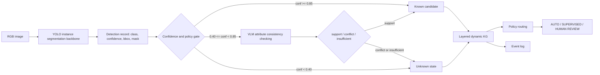

# 面向建筑废弃物机器人分拣的任务状态构建方法：YOLO 实例分割、VLM 属性一致性校验与分层动态知识图谱

> 小论文进一步完善稿 v5  
> 建议目标期刊：Automation in Construction / Advanced Engineering Informatics / Journal of Building Engineering  
> 文章类型：方法框架 + 受控原型验证  
> 当前证据边界：二维实例分割、VLM 小批量属性一致性校验、保守任务路由、软件事件追踪。当前不声称已完成真实 RealSense 在线三维定位、真实 ROS2 闭环执行或真实机械臂抓取。

---

## 英文题目建议

**Task-state construction for robotic construction and demolition waste sorting using YOLO instance segmentation, VLM-based attribute consistency checking, and layered dynamic knowledge graphs**

备选题目：

1. **From instance segmentation to auditable task states for C&D waste sorting: A constrained VLM and dynamic knowledge graph approach**
2. **Policy-aware perception-to-state transformation for robotic C&D waste sorting with unknown-object handling**
3. **Converting C&D waste perception into task-ready knowledge states through YOLO segmentation and VLM attribute verification**

建议使用第 1 个或第 2 个。第 1 个更适合方法论文，第 2 个更突出 `unknown` 和策略约束。

---

## 摘要

建筑与拆除废弃物（construction and demolition waste, C&D waste）机器人分拣不仅需要识别物体类别，还需要判断对象是否可自动处理、是否需要人工复核，以及状态变化是否可追溯。现有实例分割方法能够输出类别、置信度、边界框和掩膜，但这些视觉结果不能直接回答对象是否可被机械臂处理、为何需要复核、以及感知结果如何转化为任务规划输入。为弥合“视觉感知输出”和“任务语义状态”之间的断裂，本文提出一种面向 C&D waste 机器人分拣的任务状态构建方法。该方法以 YOLO 系列实例分割模型为二维感知主干，采用 11 个明确视觉类别，并通过 YOLO11n、YOLO11s 和 YOLOv9c 的受控测试比较确定适合原型系统的主干模型；对于低置信度、证据冲突或无法可靠归类的目标，系统不强行给出类别，而是生成 `unknown` 状态并触发人工复核。与直接使用视觉语言模型（vision-language model, VLM）进行开放式分类不同，本文将 VLM 限定为结构化视觉属性抽取器和一致性校验器，用于提取颜色、透明度、光泽、表面纹理、边缘形态和形状线索，并判断这些证据是否支持 YOLO 的类别假设。随后，系统将检测结果、VLM 校验结果和长期类别先验写入分层动态知识图谱，形成长期类别层、短期实例层、unknown 记忆入口和事件日志层。实验在冻结的 11 类 C&D waste 数据集和受控原型案例上进行。正式测试集包含 890 张图像和 19,475 个有效实例；结果显示，YOLO11s-seg 取得 Box mAP50-95 = 0.8736 和 Mask mAP50-95 = 0.7651，YOLOv9c-seg 取得更高的 Box mAP50-95 = 0.8837，但 Mask mAP50-95 = 0.7645 且计算复杂度显著更高。因此，本文将 YOLO11s-seg 作为当前精度与部署成本折中的主模型。GLM-4.5V 小批量视觉校验实验中，18 个检测目标内有 17 个触发复核，13 个获得有效结构化响应；当模型不确定或外部 API 限流时，系统保守升级为人工复核。受控路由实验在 15 个案例上取得 Policy Consistency Rate = 1.0000、Restriction Recall = 1.0000 和 Unsafe Automation Rate = 0.0000。软件事件回放实验在 32 个案例上取得 Instance Update Success Rate、Event Chain Completeness、State Version Consistency 和 Temporal Policy Consistency 均为 1.0000。结果表明，所提出方法能够在受控二维实验条件下将 C&D waste 视觉识别结果转化为策略感知、可审计和可追溯的任务状态，为后续 RGB-D 定位、机器人规划和人机协同分拣提供结构化接口。

**关键词：** 建筑与拆除废弃物；机器人分拣；实例分割；视觉语言模型；动态知识图谱；unknown 对象；任务状态；人工复核

---

## 1. 引言

建筑拆除、装修和改造活动会产生大量建筑与拆除废弃物。与规则工业零件不同，C&D waste 具有材料异质、形态不规则、尺度差异大、表面破损、遮挡堆叠和类别边界模糊等特征。部分对象还可能存在尖锐边缘、易碎风险、粉尘污染、未知材料或残留污染风险。这些因素使 C&D waste 机器人分拣不只是一个视觉识别问题，而是一个涉及感知不确定性、处理规则、人工复核和任务状态更新的自动化决策问题。

近年来，深度学习方法已被广泛用于 C&D waste 分类、目标检测、语义分割和实例分割。实例分割能够同时提供类别、位置和对象掩膜，因此比单纯边界框检测更适合作为机器人分拣的前端感知模块。掩膜可以支持后续深度点云提取、边界分析和候选抓取区域生成。然而，实例分割输出仍主要停留在“看到什么”的层面。类别、置信度和掩膜本身不能直接说明某个对象是否允许自动处理、是否需要人工审查、是否应进入监督处理，也不能解释对象状态如何随复核、人工干预或后续操作反馈而变化。

这一问题可概括为“感知到任务语义的断裂”。在 C&D waste 分拣场景中，机器人系统需要的不只是对象类别，而是可规划的任务状态。例如，砖块在高置信度、掩膜清晰且无阻塞时可作为自动夹取候选；玻璃即使被高置信度识别，也可能因易碎和割伤风险而需要监督或人工确认；低置信度、证据冲突或无法可靠归类的目标则不应被强行归入某个已知类别，而应进入 unknown 状态并等待人工复核。如果系统缺少这种中间状态层，就容易把视觉模型输出直接传递给规划器，导致风险对象被误自动处理。

VLM 和知识图谱为解决这一断裂提供了可能。VLM 可对图像局部区域进行描述和解释，知识图谱可组织类别属性、处理规则、实例状态和事件记录。然而，二者不能简单叠加。若直接让 VLM 回答“这是什么物体”，模型可能产生类别越界、幻觉、过度自信或格式不稳定等问题。若知识图谱只保存静态类别知识，也无法表达当前实例状态、unknown 对象、人工复核结果和事件演化。因此，需要一种受约束、可追溯的感知到状态转换方法，将视觉结果转化为任务规划可用的结构化状态。

本文提出一种面向 C&D waste 机器人分拣的任务状态构建方法。该方法采用 YOLO 系列实例分割模型提供实例级视觉输入，并通过 YOLO11n、YOLO11s 和 YOLOv9c 对比选择适合当前原型系统的视觉主干；随后采用 VLM 进行结构化视觉属性抽取和一致性校验，并采用分层动态知识图谱组织长期类别先验、短期实例状态、unknown 记忆入口和事件日志。本文不将 VLM 作为开放式分类器，而是将其限定为属性证据提供者；系统不将 `unknown` 作为 YOLO 训练类别，而是将其作为低置信度、证据冲突和人工复核的状态入口。

本文贡献如下：

1. 提出一种面向 C&D waste 机器人分拣的任务状态构建框架，将实例分割输出转化为包含复核状态、处理先验、unknown 状态和事件来源的可审计任务状态。
2. 设计一种 VLM 属性一致性校验机制，使 VLM 不直接替代 YOLO 分类，而是提取颜色、透明度、光泽、纹理、边缘和形状线索，并判断这些证据是否支持 YOLO 类别假设。
3. 构建长期类别层、短期实例层、unknown 记忆入口和事件日志层分离的动态知识图谱模型，以区分稳定处理先验、当前对象状态、未知对象档案和状态变化过程。
4. 通过 YOLO 实例分割测试、VLM 小批量校验、保守任务路由和软件事件回放，验证该方法在受控二维条件下的可运行性、保守性和可追溯性。

---

## 2. 相关研究与研究缺口

### 2.1 C&D waste 视觉识别

C&D waste 自动识别研究主要包括图像分类、目标检测、语义分割和实例分割。图像分类适合判断整张图像或单一目标的类别，但难以处理混合废弃物场景。目标检测可以快速定位对象，但边界框难以描述破碎材料的不规则轮廓。语义分割可以提供像素级区域，但难以区分同一类别的多个实例。实例分割能够同时输出类别、位置和对象级掩膜，因此更适合机器人分拣中的对象级状态建模。

然而，视觉识别性能并不等同于任务可执行性。一个较高的 mAP 指标说明模型在测试集上具有较好的检测或分割能力，但不能说明该对象是否安全、是否可抓取、是否需要人工复核，也不能说明状态变化是否可追踪。因此，C&D waste 分拣系统需要从“视觉识别结果”进一步转向“任务状态表示”。

### 2.2 VLM 复核及其风险

VLM 能够结合图像和文本提示进行视觉描述、属性抽取和推理。对于 C&D waste，VLM 可用于辅助处理低置信度目标、类别混淆和异常材料。然而，VLM 也存在明显风险：输出可能不稳定，可能创造不在系统类别表中的新类别，可能对模糊图像给出过度确定结论，也可能在外部 API 限流或响应异常时中断流程。

因此，VLM 更适合作为受约束的属性证据提取器，而不是开放式分类器。本文将 VLM 输出限定为结构化 JSON，并要求其报告视觉属性、证据一致性和人工复核需求。系统只将 VLM 作为证据源之一，而不允许其绕过长期知识层和任务安全规则。

### 2.3 知识图谱与动态任务状态

知识图谱能够以节点和边的形式组织类别、属性、规则和事件。在机器人系统中，知识图谱可作为世界模型，为规划器提供对象语义、任务约束和历史事件。然而，C&D waste 场景中的对象状态是动态的。对象可能被遮挡、移动、人工移除、重新出现或被后续操作影响。如果知识图谱只保存静态类别知识，就无法解释当前场景中每个对象的状态，也无法说明状态变化来自感知、VLM 校验、人工审查还是执行反馈。

本文采用分层动态知识图谱：长期类别层保存稳定类别先验，短期实例层保存当前对象状态，unknown 记忆入口保存无法可靠归类的对象档案，事件日志层记录观测、复核、路由和状态变化。该设计面向任务状态构建，而不是百科式知识存储。

### 2.4 研究缺口

现有研究仍存在以下不足：

1. 实例分割输出与机器人任务状态之间缺少可审计的转换机制；
2. VLM 在废弃物分拣中的应用容易被设计成开放式分类，缺少类别约束、属性证据和失败回退；
3. 知识图谱常被用作静态知识库，较少表达短期实例状态、unknown 记忆和事件级追溯；
4. 现有视觉识别研究通常报告检测或分割指标，但较少评估识别结果是否被正确路由为自动候选、监督候选或人工复核。

本文针对这些缺口提出策略感知任务状态构建方法，并在受控原型实验中验证其可运行性和边界。

---

## 3. 方法

### 3.1 总体框架

本文方法包括四个步骤：实例分割、属性一致性校验、分层知识状态更新和保守任务路由。



该框架不直接输出机械臂动作，而是输出可供后续规划器读取的任务状态。任务状态包括最终类别、置信度、VLM 证据、复核状态、长期类别先验、任务路由、状态版本和事件来源。

### 3.2 视觉类别与 unknown 状态

本文采用 11 个明确视觉类别：

```text
concrete, brick, tile, wood, gypsum_board, foam,
metal, soft_plastic, hard_plastic, paperboard, glass
```

`unknown` 不作为 YOLO 训练类别。原因是 unknown 没有稳定视觉外观，其本质是“不属于当前已知类”或“当前证据不足以安全归类”。系统在以下情况下生成 `unknown`：

```text
YOLO confidence < 0.40
VLM 属性与 YOLO 假设冲突
VLM 认为证据不足
外部标签涉及当前不可靠类别
人工复核前不宜自动处理
```

这种设计避免将疑似危险或未见材料强行归入某个已有类别，也避免训练一个视觉边界不稳定的 unknown 类。

### 3.3 实例分割记录标准化

YOLO 系列实例分割模型对输入 RGB 图像进行对象级分割。本文以 YOLO11n-seg 作为轻量基线，以 YOLO11s-seg 作为增强主模型，并引入 YOLOv9c-seg 作为高容量对比模型。每个检测结果被标准化为：

```text
detection_id
image_id
yolo_class_name
yolo_confidence
bbox_2d
mask_polygon
boundary_points
timestamp
source
```

这些记录进一步转换为图谱中的短期实例节点：

```text
instance_id
class_name
yolo_confidence
llm_confidence
final_confidence
review_status
bbox_2d
mask_polygon
boundary_points
task_status
state_version
metadata
```

当前小论文验证二维视觉状态和策略状态。`center_xyz`、`bbox_3d`、`blocked_by`、`supports`、`grasp_candidates` 和 `safe_grasp_score` 作为后续 RealSense 和机械臂实验接口保留，但不作为本文已验证结果。

### 3.4 VLM 属性一致性校验

VLM 的输入包括目标裁剪图、mask overlay 图、YOLO 类别假设、YOLO 置信度和允许类别列表。与直接要求 VLM 输出类别不同，本文要求 VLM 返回结构化视觉属性和一致性判断：

```json
{
  "decision": "agree | change | uncertain",
  "proposed_class": "one of allowed classes",
  "confidence": 0.0,
  "visual_attributes": {
    "color": "...",
    "transparency": "...",
    "gloss": "...",
    "surface_texture": "...",
    "edge_shape": "...",
    "shape_cue": "..."
  },
  "consistency": "support | conflict | insufficient",
  "requires_human_review": true,
  "reason": "short visual rationale"
}
```

系统执行三类约束：

1. 类别必须在允许列表中；
2. 输出必须可解析；
3. 不确定、冲突、API 错误和限流均触发人工复核。

融合规则如下：

| VLM 输出 | 系统处理 |
|---|---|
| `agree` + `support` | 保留 YOLO 类别并记录复核通过 |
| `change` 且类别合法 | 采用 VLM 建议类别，但记录类别变化事件 |
| `uncertain` 或 `insufficient` | 保留 YOLO 原始证据，进入人工复核 |
| `conflict` | 进入 unknown 或人工复核 |
| API、限流、解析错误 | 保留原始证据，进入人工复核 |

### 3.5 分层动态知识图谱

知识图谱由四类核心状态组成：

```text
Category：长期类别层
Instance：短期实例层
UnknownObjectMemory：未知对象记忆入口
Event：事件日志层
```

长期类别层保存稳定先验，例如风险等级、易碎性、污染风险、默认处理方式、是否建议 VLM 校验和是否允许自动处理。短期实例层保存当前对象状态，例如类别、置信度、掩膜、复核状态和任务状态。UnknownObjectMemory 保存无法可靠归类的目标，包括裁剪图、mask、VLM 属性、出现次数、人工复核状态和建议新类别。事件日志层记录 `OBSERVED`、`REVIEWED`、`POLICY_PROJECTED`、`ROUTED`、`REMOVED`、`REAPPEARED` 和 `REVIEW_ERROR_FALLBACK` 等事件。

### 3.6 保守任务路由

任务路由包括三类：

```text
AUTO_CANDIDATE
SUPERVISED_CANDIDATE
HUMAN_REVIEW_REQUIRED
```

路由规则遵循保守优先原则：

- 若实例为 `unknown`，进入 `HUMAN_REVIEW_REQUIRED`；
- 若 VLM 输出不确定、冲突或错误，进入 `HUMAN_REVIEW_REQUIRED`；
- 若长期类别先验为 `human_review` 或 `human_only`，进入 `HUMAN_REVIEW_REQUIRED`；
- 若类别允许机器人处理但需要监督，进入 `SUPERVISED_CANDIDATE`；
- 只有当类别、置信度、复核状态和处理规则均满足条件时，才进入 `AUTO_CANDIDATE`。

---

## 4. 实验设计

### 4.1 研究问题

实验围绕四个问题展开：

1. YOLO 系列实例分割模型能否为知识状态构建提供可用的二维实例分割输入，且哪一类模型更适合作为当前原型主干？
2. VLM 属性一致性校验能否处理局部图像证据，并在不确定或失败时保守回退？
3. 分层知识状态能否将对象实例投影为一致的任务路由？
4. 事件日志能否维护状态版本和状态变化链？

### 4.2 数据与类别

本文冻结 11 类视觉输出类别：

```text
concrete, brick, tile, wood, gypsum_board, foam,
metal, soft_plastic, hard_plastic, paperboard, glass
```

当前研究不训练 `unknown` 类，也不声称可通过 RGB 图像确认专业危险材料。疑似危险或无法可靠分类对象进入 `unknown` 和人工复核流程。

### 4.3 模型与环境

实例分割模型采用 YOLO11n-seg、YOLO11s-seg 和 YOLOv9c-seg 进行对比。YOLO11n-seg 用作轻量基线，便于在 8 GB 显存笔记本 GPU 上快速迭代；YOLO11s-seg 用作精度与部署成本折中的候选主模型；YOLOv9c-seg 用作高容量对比模型，用于检验更大模型是否能带来显著收益。训练和推理环境为 Windows 11 x64，GPU 为 NVIDIA GeForce RTX 5060 Laptop GPU，显存约 8 GB。

VLM 校验采用 GLM-4.5V，接口配置为：

```text
LLM_BASE_URL=https://api.siliconflow.cn/v1
LLM_MODEL=zai-org/GLM-4.5V
LLM_RESPONSE_FORMAT_JSON=false
```

由于接口不支持强制 JSON mode，本文通过 prompt 约束输出结构，并在本地执行解析、白名单校验和失败回退。

### 4.4 评价指标

实例分割采用 Box mAP50-95 和 Mask mAP50-95。VLM 校验采用复核覆盖率、有效响应率、人工复核率、决策分布和平均延迟。任务路由采用 Policy Consistency Rate、Restriction Recall、Unsafe Automation Rate、Over-conservative Rate 和 Human Escalation Rate。事件追踪采用 Instance Update Success Rate、Event Chain Completeness、State Version Consistency 和 Temporal Policy Consistency。

---

## 5. 结果

### 5.1 实例分割模型对比

实例分割模型在同一冻结测试集上评估。测试集包含 890 张图像和 19,475 个有效实例。为避免只报告单一模型造成结论偏差，本文比较了轻量基线、增强候选模型和高容量模型。

| 模型 | 训练轮数 | Box mAP50-95 | Mask mAP50 | Mask mAP50-95 | Mask P | Mask R | 推理耗时/ms | 说明 |
|---|---:|---:|---:|---:|---:|---:|---:|---|
| YOLO11n-seg | 50 | 0.8437 | 0.9363 | 0.7397 | 0.9428 | 0.8908 | 5.2 | 轻量基线 |
| YOLO11n-seg | 100 | 0.8528 | 0.9411 | 0.7493 | 0.9524 | 0.8946 | 5.2 | 增加训练轮数后略有提升 |
| YOLO11s-seg | 50 | 0.8736 | 0.9476 | 0.7651 | 0.9483 | 0.9053 | 5.4 | 当前推荐主模型 |
| YOLOv9c-seg | 50 | 0.8837 | 0.9469 | 0.7645 | 0.9485 | 0.9077 | 14.1 | 高容量对比模型 |

结果表明，YOLO11n-seg 从 50 轮增加到 100 轮可以提升 Mask mAP50-95，但提升幅度有限，说明在当前数据条件下，单纯延长轻量模型训练轮数不能完全弥补模型容量限制。YOLO11s-seg 取得最高 Mask mAP50-95（0.7651），适合作为本文后续任务状态构建实验的主模型。YOLOv9c-seg 取得最高 Box mAP50-95（0.8837），但 Mask mAP50-95 略低于 YOLO11s-seg，且推理耗时约为 YOLO11s-seg 的 2.6 倍。因此，若目标是二维框定位，YOLOv9c-seg 具有优势；若目标是为知识图谱和后续抓取提供对象掩膜，YOLO11s-seg 是更合理的精度与部署成本折中选择。

该结论限于二维视觉层面，不代表三维定位或机械臂执行已经验证。对于机器人抓取而言，Mask mAP50-95 比 Box mAP50-95 更接近后续点云裁剪、边界估计和候选抓取区域生成需求，但仍需要 RealSense 深度校准和抓取实验进一步验证。

### 5.2 主模型类别级性能

YOLO11s-seg 的类别级结果如下。表中 `instances` 表示测试集中该类别有效实例数量。

| 类别 | instances | Box P | Box R | Box mAP50-95 | Mask P | Mask R | Mask mAP50-95 |
|---|---:|---:|---:|---:|---:|---:|---:|
| concrete | 6,893 | 0.9603 | 0.9435 | 0.8850 | 0.9587 | 0.9388 | 0.7598 |
| brick | 257 | 0.9807 | 0.9877 | 0.9776 | 0.9807 | 0.9871 | 0.8530 |
| tile | 235 | 0.9469 | 0.9447 | 0.9639 | 0.9481 | 0.9447 | 0.8363 |
| wood | 2,205 | 0.9610 | 0.8853 | 0.8753 | 0.9600 | 0.8825 | 0.7742 |
| gypsum_board | 218 | 0.9429 | 0.8991 | 0.9075 | 0.9463 | 0.8991 | 0.8417 |
| foam | 142 | 0.9343 | 0.9012 | 0.9124 | 0.9341 | 0.8991 | 0.8783 |
| metal | 3,666 | 0.9339 | 0.8713 | 0.7878 | 0.9234 | 0.8546 | 0.5669 |
| soft_plastic | 872 | 0.9261 | 0.7903 | 0.7509 | 0.9268 | 0.7840 | 0.6744 |
| hard_plastic | 3,594 | 0.9518 | 0.9122 | 0.8702 | 0.9506 | 0.9085 | 0.7235 |
| paperboard | 980 | 0.9066 | 0.8811 | 0.8488 | 0.9124 | 0.8827 | 0.7730 |
| glass | 413 | 1.0000 | 0.9913 | 0.8299 | 0.9902 | 0.9772 | 0.7353 |

类别级结果显示，`metal`、`soft_plastic` 和 `hard_plastic` 的 Mask mAP50-95 相对较低，说明复杂边界、反光材质、遮挡和形态变化仍会影响掩膜质量。`glass` 的检测精度较高，但由于其易碎性和割伤风险，即使视觉识别稳定，也不应直接进入无监督自动处理。本文因此将类别先验、模型置信度、VLM 属性证据和任务路由规则共同写入知识状态：表现稳定且低风险的类别可进入自动候选，风险类别或弱分割类别则触发监督处理、VLM 校验或人工复核。

### 5.3 VLM 属性一致性校验

单图测试中，YOLO 将目标识别为 `hard_plastic`，置信度为 0.9547；GLM-4.5V 返回 `uncertain`；系统保留 YOLO 类别并将 `review_status` 设置为 `human_review_required`。该结果验证了不确定条件下的保守回退逻辑。

20 图小批量校验结果如下：

| 指标 | 数值 |
|---|---:|
| image_count | 20 |
| detection_count | 18 |
| reviewed_count | 17 |
| review_coverage | 0.9444 |
| valid_vlm_response_count | 13 |
| valid_vlm_response_rate | 0.7647 |
| human_review_required_count | 9 |
| human_review_required_rate | 0.5000 |
| mean_latency_seconds | 8.4690 |
| agree | 8 |
| change | 0 |
| uncertain | 5 |
| review_error | 4 |
| not_reviewed | 1 |

4 个 `review_error` 均来自 `HTTP 429 TPM limit reached`。因此，当前限制主要来自外部模型服务配额，而不是本地视觉证据生成、JSON 解析或图谱更新逻辑。该结果支持 VLM 属性校验链路的小批量可运行性，但不支持“VLM 已显著提升完整测试集准确率”的结论。

### 5.4 保守任务路由

受控路由实验包含 15 个案例。结果如下：

| 指标 | 数值 |
|---|---:|
| case_count | 15 |
| Policy Consistency Rate | 1.0000 |
| Restriction Recall | 1.0000 |
| Unsafe Automation Rate | 0.0000 |
| Over-conservative Rate | 0.0000 |
| Human Escalation Rate | 0.5333 |

结果显示，在当前受控案例和保守策略库中，低置信度、unknown、复核异常和策略敏感对象不会被直接路由为自动处理候选。该实验验证的是动作前任务语义路由，不是机械臂真实执行。

### 5.5 事件追踪与状态一致性

软件事件回放覆盖 32 个受控案例，包括正常确认、VLM 纠错、VLM 不确定回退、低置信度人工复核、unknown 敏感标签、对象移除、对象重新出现和 API/schema 异常回退。结果如下：

| 指标 | 数值 |
|---|---:|
| case_count | 32 |
| Instance Update Success Rate | 1.0000 |
| Event Chain Completeness | 1.0000 |
| State Version Consistency | 1.0000 |
| Temporal Policy Consistency | 1.0000 |

结果表明，当前软件原型能够维护状态版本、事件链完整性和跨时间策略一致性。该结果证明的是软件事件追踪能力，而非真实机械臂执行或严格图片移除再感知。

### 5.6 严格图片序列审查

项目额外审查了 before/after 图片序列候选。可用于论文正文的图片对必须满足固定相机、固定背景、仅移除一个对象、其他对象位置和形态基本不变、后图无新增对象等条件。现有候选图多数存在物体替换、摆放变化、视角变化或被移除对象过小等问题，不能作为正式证据。因此，严格图片序列再感知仍需后续补拍。该结论有助于控制论文边界，避免将软件事件回放误写为真实物理闭环。

---

## 6. 讨论

### 6.1 感知到任务状态的转换价值

本文结果表明，C&D waste 分拣前端不能仅依赖实例分割指标。机器人系统需要将视觉输出转换为包含复核状态、处理约束、unknown 状态和任务路由的结构化状态。所提出的 YOLO-to-KG 接口和分层知识状态为这一转换提供了实现路径。

这一结果对建筑自动化研究具有方法意义。许多视觉模型能够输出较高的 mAP，但 mAP 本身并不能说明对象是否适合自动处理。对于机器人分拣，系统还需要回答“该对象是否危险”“是否需要人工复核”“识别依据来自哪里”“状态何时发生变化”等问题。本文的任务状态构建方法正是面向这些问题设计。

### 6.2 VLM 作为属性证据源，而不是开放式分类器

VLM 在本文中不是独立分类器，而是受约束的属性证据源。E2 结果显示，VLM 可以处理 crop 和 mask overlay 证据，但也会返回不确定结果或遭遇 API 限流。因此，保守回退和人工升级机制是该模块能够进入机器人任务链的前提。

这一设计避免了两个风险：一是直接信任开放式模型输出导致类别越界或误分类；二是在模型失败时中断整个任务状态构建流程。本文采用的策略是：VLM 可以提供视觉属性和一致性判断，但不能绕过类别白名单、解析校验和长期知识层中的安全约束。

### 6.3 unknown 状态的意义

`unknown` 的意义不是训练一个新类别，而是让系统在证据不足时停止强行归类。对于 C&D waste 这种外观变化大、材料边界模糊的场景，unknown 状态可以将低置信度、类别冲突和疑似风险对象统一纳入人工复核流程。更重要的是，unknown 对象可以被保存为历史档案。当类似未知物体反复出现时，系统可提示操作员复核，并在人工确认后将其加入未来训练候选集。

因此，unknown 状态为系统进化提供了接口，但不会自动污染训练集。新增类别必须经过人工确认、属性补充、标注审核和模型评估。

### 6.4 动态知识图谱的职责边界

长期类别层、短期实例层、unknown 记忆入口和事件日志层分别承担稳定先验、当前状态、未知档案和过程记录。该分层设计避免将静态知识与实时观测混合，也为后续规划器查询对象状态、人工复核原因和事件来源提供基础。

需要强调的是，本文当前验证的是分层动态知识状态原型，而不是完整物理动态场景闭环。事件回放验证了状态记录和版本一致性，但还没有证明机械臂执行后真实场景被重新观测并更新。因此，本文对“dynamic”的使用应限定在状态表示和事件追踪层面，而不是扩展为真实动态物理环境验证。

---

## 7. 局限性

本文存在以下局限。

第一，实验仍限于二维视觉和软件状态验证，尚未接入 RealSense D435i 在线深度图、三维定位和空间关系推断。

第二，VLM 校验仍为小批量验证，受外部 API token 配额限制，尚未覆盖完整测试集，也尚未形成 YOLO-only 与 YOLO+VLM 的完整精度对比。

第三，路由实验基于受控案例，验证的是规则一致性，不证明视觉模型不会误检，也不证明机械臂执行安全。

第四，事件追踪实验是软件回放，尚未获得严格 before/after 图片再感知证据。现有候选图片经重新审查后不能作为正式论文证据。

第五，`unknown` 只能表示系统无法可靠归类或需要人工复核，不能替代专业材料检测或危险废弃物鉴定。

---

## 8. 结论

本文提出一种面向 C&D waste 机器人分拣的任务状态构建方法，融合 YOLO 系列实例分割、VLM 属性一致性校验和分层动态知识图谱。该方法将二维视觉识别结果转化为带有复核状态、处理先验、unknown 入口、任务路由和事件日志的可审计状态。

实验结果显示，在 890 张测试图像和 19,475 个有效实例上，YOLO11s-seg 取得 Box mAP50-95 = 0.8736 和 Mask mAP50-95 = 0.7651，较 YOLO11n-seg 具有更好的二维实例分割能力；YOLOv9c-seg 取得更高的 Box mAP50-95 = 0.8837，但 Mask mAP50-95 略低且推理成本明显更高。基于掩膜质量和部署成本，本文选择 YOLO11s-seg 作为当前原型的主模型。GLM-4.5V 小批量校验获得 13/17 的有效结构化响应，并能够在不确定或限流时触发人工复核；受控路由实验取得 Policy Consistency Rate = 1.0000、Restriction Recall = 1.0000 和 Unsafe Automation Rate = 0.0000；软件事件回放取得四项状态追踪指标均为 1.0000。这些结果表明，所提出方法能够在受控二维实验条件下支持策略感知和事件可追溯的任务状态构建。

未来工作将优先补拍严格 before/after 图片序列，以验证人工移除后的图像再感知和状态更新；随后接入 RealSense D435i，生成三维实例坐标和空间关系；最后在 ROS2/MoveIt2 环境中开展低风险类别机械臂空跑和实体抓取实验，并将执行反馈写入事件日志。

---

## 9. 建议图表清单

| 编号 | 图表内容 | 当前状态 | 证据位置 |
|---|---|---|---|
| Fig. 1 | 系统总体框架：YOLO -> VLM 属性校验 -> DKG -> 任务路由 | 可绘制 | 本文方法第 3.1 节 |
| Fig. 2 | 长期类别层、短期实例层、unknown 入口、事件日志层 | 可绘制 | `docs/knowledge_seed_zh.md` |
| Fig. 3 | VLM 属性一致性校验与 conservative fallback 流程 | 可绘制 | `wastekg/llm_reviewer.py` |
| Fig. 4 | YOLO 模型对比、验证预测、混淆矩阵和 Mask PR 曲线 | 已有图片 | `artifacts/model_comparison_test/yolo11s_e50/ultralytics/metrics` |
| Fig. 5 | 典型分割案例 | 已有初步图片 | `artifacts/e1_qualitative_samples_r1` |
| Fig. 6 | E2 VLM 三联图：prediction / crop / mask overlay | 已有图片 | `artifacts/paper/e2_vlm_glm45v_batch20_r3_focused/images/001_cdw2026_2022_0345` |
| Fig. 7 | E3 保守路由流程 | 可绘制 | `artifacts/paper/e3_policy_routing` |
| Fig. 8 | E4 controlled event replay chain | 可绘制 | `artifacts/paper/e4_event_replay` |
| Table 1 | 数据集 split 与类别分布 | 需补完整 train/val | `datasets/waste11_grouped_v1` |
| Table 2 | 模型与环境配置 | 已有信息 | `artifacts/model_comparison_test/yolo11s_e50/evaluation_manifest.json` |
| Table 3 | 长期知识层策略表 | 已有 | `wastekg/knowledge_base.py` |
| Table 4 | YOLO 模型对比和类别级指标 | 已整理在本文 | `artifacts/model_comparison_test` |
| Table 5 | VLM 校验结果 | 已整理在本文 | `artifacts/paper/e2_vlm_glm45v_batch20_r3_focused/e2_vlm_batch_summary.json` |
| Table 6 | E3 路由案例与指标 | 指标已有，案例表需精选 | `artifacts/paper/e3_policy_routing` |
| Table 7 | E4 软件事件回放指标 | 已整理在本文 | `artifacts/paper/e4_event_replay` |
| Table 8 | 当前已验证能力与尚未验证能力边界 | 建议新增 | 本文局限性与讨论 |

---

## 10. 投稿前必须补齐的内容

1. **参考文献**：补齐 C&D waste 识别、实例分割、VLM 属性识别、open-world detection、知识图谱和机器人任务规划相关文献。
2. **数据集统计表**：补全 train/val/test 图像数、实例数和每类实例分布。
3. **混淆矩阵分析**：从 `confusion_matrix_normalized.png` 中提取最严重混淆对，并配代表图。
4. **E2 图像证据图**：制作三联图，展示 YOLO 预测、VLM crop、mask overlay。
5. **E3 典型路由案例表**：覆盖 `AUTO_CANDIDATE`、`SUPERVISED_CANDIDATE` 和 `HUMAN_REVIEW_REQUIRED`。
6. **E4 事件链图**：明确写成 controlled software event replay，不写成真实机械臂执行。
7. **严格 before/after 图片**：若要强化动态性，需要后续补拍 5-10 组固定视角图片。
8. **术语统一**：全文统一使用 `task-state construction`、`VLM-based attribute consistency checking`、`unknown-object handling` 和 `layered dynamic knowledge graph`。

---

## 11. 当前最需要避免的过度表述

不建议写：

```text
本文实现了完整建筑废弃物机器人自主分拣系统。
```

建议写：

```text
本文实现并验证了一个受控原型，用于将 C&D waste 二维实例分割结果转换为策略感知和可审计的任务状态。
```

不建议写：

```text
VLM 显著提高了建筑废弃物识别准确率。
```

建议写：

```text
VLM 小批量实验验证了属性一致性校验和失败回退链路的可运行性，但尚未构成完整准确率提升实验。
```

不建议写：

```text
系统能够识别所有危险废弃物或确认石棉。
```

建议写：

```text
系统能够将无法可靠归类或疑似风险对象转入 unknown 和人工复核状态，但不替代专业材料检测。
```

不建议写：

```text
E4 验证了真实移除后的图像再感知。
```

建议写：

```text
E4 当前验证了软件事件追踪和状态一致性；严格图片再感知仍需补拍 before/after 样本。
```

---

## 12. 证据文件索引

```text
E1 model comparison root:
artifacts/model_comparison_test

E1 YOLO11s main-model overall metrics:
artifacts/model_comparison_test/yolo11s_e50/overall_metrics.json

E1 YOLO11s main-model per-class metrics:
artifacts/model_comparison_test/yolo11s_e50/per_class_metrics.csv

E1 YOLOv9c high-capacity comparison metrics:
artifacts/model_comparison_test/yolov9c_e50/overall_metrics.json

E1 qualitative samples:
artifacts/e1_qualitative_samples_r1

E2 VLM batch summary:
artifacts/paper/e2_vlm_glm45v_batch20_r3_focused/e2_vlm_batch_summary.json

E2 VLM visual evidence:
artifacts/paper/e2_vlm_glm45v_batch20_r3_focused/images/001_cdw2026_2022_0345

E3 policy routing:
artifacts/paper/e3_policy_routing

E4 software event replay:
artifacts/paper/e4_event_replay

E4 strict removal candidate audit:
docs/e4_strict_removal_audit_summary_zh.md
artifacts/paper/e4_image_sequence_candidates/strict_removal_candidate_audit.md
```

---

## 13. 本版相对 v4 的主要完善

1. 将论文主线从“VLM 复核类别”调整为“VLM 属性一致性校验”，避免把 VLM 写成开放式分类器。
2. 将类别体系调整为“11 个明确视觉类别 + 系统逻辑生成 unknown”，不再把 `asbestos_suspect` 写成默认视觉输出类别。
3. 增加 unknown 对象记忆与类别进化逻辑，强调人工确认、标注审核和下一轮训练，而不是自动污染训练集。
4. 强化感知到任务状态转换的研究缺口，突出“实例分割输出不能直接回答是否可处理、是否需复核、为何如此”。
5. 增加 VLM 属性字段，如颜色、透明度、光泽、表面纹理、边缘形态和形状线索，使方法逻辑更可审计。
6. 进一步收紧证据边界：E2 是小批量链路验证，E3 是受控策略路由，E4 是软件事件回放，不声称真实机器人闭环。
