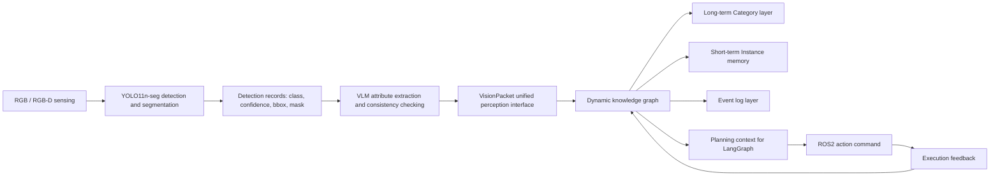

# 复杂动态建筑环境中的危险废弃物认知与人机协同自治决策：方法设计、实现过程与阶段性实验记录

> 状态说明：本文是历史论文写作补充材料，不是当前系统字段或接口规范。知识图谱节点、关系、事件和规划边界必须以 [knowledge_seed_zh.md](../../docs/knowledge_seed_zh.md)、当前代码和测试为准；本文中的历史字段仅用于追溯原型演进。

> 本文档用于支撑后续科研论文写作，重点沉淀系统总体逻辑、数据与模型训练、双层动态知识图谱构建、YOLO 与大模型复核接入、Neo4j 可视化、以及面向后续 RealSense、LangGraph 和 ROS2 抓取规划的接口设计。  
> 当前内容属于“方法与原型验证阶段”记录，适合后续扩展为论文的 Methodology、System Architecture、Prototype Implementation、Experimental Setup 和 Preliminary Results 部分。

---

## 1. 研究问题与系统定位

复杂建筑拆除、装修和改造环境中的废弃物处理具有明显的非结构化特征。目标物种类复杂，形态不规则，堆叠、遮挡和接触关系频繁变化，且部分对象可能存在割伤、粉尘、未知材料或易碎污染等安全风险。传统单帧目标检测只能回答“图像中出现了什么”，但难以稳定回答以下任务规划问题：

- 某个对象是否可由机械臂夹取；
- 当前对象是否被其他对象遮挡、压覆或阻塞；
- 哪些对象需要人工复核或人工处理；
- 机械臂执行一次动作后，场景状态如何更新；
- 多智能体系统如何读取统一、可追踪、可规划的世界状态。

因此，本研究不把视觉识别结果直接作为规划输入，而是引入“长期知识层 + 短期记忆层 + 事件日志层”的动态知识图谱，将感知、语义、风险、状态、关系和执行反馈统一到一个可演化的世界模型中。

系统定位如下：

```text
YOLO/RealSense：负责感知明确类别、轮廓和空间位置
VLM 属性校验：负责中置信度目标的结构化视觉属性抽取和一致性校验
知识图谱：负责长期知识、短期状态、事件追踪和规划状态输出
LangGraph 多智能体：负责检索、推理、任务分解和人机协同决策
ROS2 执行层：负责机械臂动作执行和执行结果回写
```

该架构的核心思想是：视觉模型不直接决定机械臂动作，而是先将感知结果写入知识图谱，再由图谱输出结构化、可解释、可审查的规划状态。

---

## 2. 总体系统架构

### 2.1 模块划分

当前项目位于：

```text
C:\Users\12279\Documents\multiagent\subprojects\dynamic-waste-kg
```

当前子项目承担“核心世界模型”职责，主要包含：

- 废弃物长期知识层；
- 当前场景短期记忆层；
- 事件日志层；
- YOLO 与大模型识别结果接入口；
- RGB-D 几何补全接口；
- Neo4j 导出与可视化；
- LangGraph 和 ROS2 的状态输出接口。

后续完整系统建议采用多子项目结构：

```text
multiagent/
  subprojects/
    dynamic-waste-kg/       # 知识图谱与世界模型
    dynamic-waste-agent/    # LangGraph 多智能体任务规划
    dynamic-waste-ros2/     # ROS2 机械臂执行层
    dynamic-waste-ui/       # 人机协同前端界面
    dynamic-waste-sim/      # 可选仿真环境
```

其中 `dynamic-waste-kg` 不直接控制机械臂，也不承担 UI 展示，而是作为感知、规划和执行之间的共享状态层。

### 2.2 数据流

当前已实现的数据流为：

```text
输入图像
  -> YOLO11n-seg 实例分割
  -> 结构化检测记录 yolo_records.json
  -> VLM 对中置信度目标进行属性一致性校验
  -> 统一感知包 vision_packet.json
  -> 知识图谱更新
  -> graph_snapshot.json / events.jsonl / neo4j_import.cypher
  -> Neo4j 可视化与规划接口
```

后续接入 RealSense 后，数据流扩展为：

```text
RealSense color.png + aligned_depth.png + camera_intrinsics.json
  -> YOLO11n-seg 输出类别、置信度、bbox、mask
  -> mask + aligned depth 计算 center_xyz、bbox_3d、visible_area_ratio
  -> 生成 grasp_candidates 与 safe_grasp_score
  -> 写入短期记忆层 Instance
  -> LangGraph 规划器读取可操作对象和人工复核对象
  -> ROS2 执行后回写事件日志与短期状态
```

### 2.3 系统流程图



---

## 3. 数据集构建与类别体系

### 3.1 目标类别

当前研究采用 11 个明确视觉类别。`unknown` 由系统逻辑生成，不作为 YOLO 训练类别：

```text
concrete
brick
tile
wood
gypsum_board
foam
metal
soft_plastic
hard_plastic
paperboard
glass
```

类别设计原则是“支持任务规划，而非追求百科式完整”。因此，类别数量被控制在机械臂分拣、人工复核和风险处理能够实际使用的范围内。

当前长期知识层与规划规则以 11 类为准。历史数据集中若仍出现第 12 类配置，应视为旧实验产物或待迁移数据，不再作为当前方法设计的默认类别。

当前数据集配置文件：

```text
datasets/waste12_yolo/data.yaml
```

注意：`waste12_yolo` 是历史目录名，不代表当前方法仍采用 12 个明确视觉类别。当前设计以 11 个已知类为准，`unknown` 由系统逻辑生成。

类别索引如下：

| ID | 类别 |
|---:|---|
| 0 | concrete |
| 1 | brick |
| 2 | tile |
| 3 | wood |
| 4 | gypsum_board |
| 5 | foam |
| 6 | metal |
| 7 | soft_plastic |
| 8 | hard_plastic |
| 9 | paperboard |
| 10 | glass |

### 3.2 类别映射原则

为了融合来自不同来源的数据集，项目中设置了轻量标签映射，而不是无限扩展新类别。例如：

| 外部标签 | 本研究类别 |
|---|---|
| stone / aggregate | concrete |
| pipe / pipes | hard_plastic |
| cardboard | paperboard |
| timber | wood |
| plasterboard / gypsum | gypsum_board |
| steel | metal |
| asbestos / asbestos_suspect | unknown |

这样可以避免规划器面对过多细碎类别，也避免在没有可靠视觉证据和专业检测依据时让模型“确认”危险材料。疑似危险或无法可靠归类的对象统一进入 `unknown` 和人工复核流程。

### 3.3 数据集规模

当前 YOLO 格式数据集位于：

```text
datasets/waste12_yolo
```

划分规模为：

| Split | 图像数 | 标注文件数 |
|---|---:|---:|
| train | 4109 | 4109 |
| val | 1054 | 1054 |
| test | 772 | 772 |

该数据集由多个建筑垃圾、装修废弃物和玻璃碎片相关数据源合并而成，并通过统一类别映射转换为 YOLO segmentation 格式。

---

## 4. YOLO11n-seg 训练过程

### 4.1 模型选择

当前采用 Ultralytics YOLO11n-seg。选择轻量级 `n` 版本的原因是：

- 当前显卡为 RTX 5060 Laptop GPU，显存约 8 GB；
- 研究阶段需要多次快速迭代数据集和类别体系；
- 后续可能部署到实际分拣系统，轻量模型更适合实时性需求；
- segmentation 模型可直接输出 mask，比纯检测 bbox 更适合后续深度点云和抓取候选点生成。

需要注意：YOLO11n-seg 是初始原型的合理选择，不代表最终模型必须固定为该版本。若后续精度不足，可以比较 YOLO11s/m-seg、分割增强方法或专用边界引导抓取模型。

### 4.2 训练环境

当前 Windows 训练环境：

```text
OS: Windows 11 x64
GPU: NVIDIA GeForce RTX 5060 Laptop GPU
VRAM: 8 GB
Python: 3.14
PyTorch: 2.12.0.dev + cu128
Ultralytics: 8.4.66
CUDA runtime used by PyTorch: 12.8
```

使用 nightly PyTorch 的原因是 RTX 5060 较新，需要支持更新的 GPU 架构。

### 4.3 训练参数

主模型训练目录：

```text
outputs/yolo_runs/segment/runs/waste12_seg/yolo11n_seg_cdw_glass_e50
```

主要参数来自：

```text
outputs/yolo_runs/segment/runs/waste12_seg/yolo11n_seg_cdw_glass_e50/args.yaml
```

关键训练配置：

| 参数 | 值 |
|---|---|
| task | segment |
| model | previous best checkpoint |
| epochs | 50 |
| batch | 4 |
| imgsz | 640 |
| device | 0 |
| optimizer | auto |
| pretrained | true |
| amp | true |
| mosaic | 1.0 |
| fliplr | 0.5 |
| close_mosaic | 10 |
| patience | 100 |

训练命令形式：

```powershell
.\.venv\Scripts\python.exe scripts\yolo\train_yolo_seg.py `
  --data datasets\waste12_yolo\data.yaml `
  --model yolo11n-seg.pt `
  --epochs 50 `
  --imgsz 640 `
  --device 0
```

实际训练过程中曾基于已有 checkpoint 继续训练，以提升合并数据集后的稳定性。

---

## 5. YOLO 训练结果与阶段性分析

### 5.1 总体指标

主模型 `yolo11n_seg_cdw_glass_e50` 第 50 epoch 结果如下：

| 指标 | Box | Mask |
|---|---:|---:|
| Precision | 0.8403 | 0.8387 |
| Recall | 0.7569 | 0.7546 |
| mAP50 | 0.8031 | 0.7959 |
| mAP50-95 | 0.6898 | 0.6017 |

最终损失：

| Loss | 数值 |
|---|---:|
| train/box_loss | 0.5124 |
| train/seg_loss | 0.8067 |
| train/cls_loss | 0.4087 |
| train/dfl_loss | 0.8454 |
| val/box_loss | 0.5882 |
| val/seg_loss | 1.0895 |
| val/cls_loss | 0.7271 |
| val/dfl_loss | 0.9149 |

对比早期 3 epoch baseline：

| 模型 | Mask mAP50 | Mask mAP50-95 |
|---|---:|---:|
| yolo11n_seg_baseline, 3 epochs | 0.7009 | 0.5188 |
| yolo11n_seg_cdw_glass_e50, 50 epochs | 0.7959 | 0.6017 |

这说明扩展训练和数据集融合对 mask 分割性能有明显提升。但 mask mAP50-95 仍低于 box mAP50-95，说明轮廓质量、边界贴合度和复杂遮挡场景仍是后续优化重点。

### 5.2 训练曲线与可视化材料

训练曲线：


混淆矩阵：


归一化混淆矩阵：


Mask PR 曲线：


验证集预测示例：


### 5.3 对机械臂抓取的影响

对抓取任务而言，bbox 并不是唯一关键。YOLO-seg 输出包括：

```text
bbox_xyxy
mask_polygon
boundary_points
yolo_class_name
yolo_confidence
```

其中 `mask_polygon` 和后续 RealSense 深度点更重要。原因是：

- bbox 只是外接矩形，容易包含背景或相邻物体；
- mask 更接近物体真实可见轮廓；
- RealSense aligned depth 可以在 mask 内提取有效深度点；
- 抓取候选点应基于 mask 内点云、边界点和安全分数生成，而不是直接使用 bbox 中心。

因此，当前模型的 mask mAP50-95 仍需继续优化，但阶段性结果已经足以支撑“图谱构建与规划接口验证”。对于真实机械臂夹取，后续仍需完成 RGB-D 定位稳定性测试、手眼标定和空跑验证。

---

## 6. 长期知识层设计

### 6.1 设计原则

长期知识层表示稳定语义和处理先验，不随单帧观测变化。该层不追求百科式属性，而只保留会影响任务规划的核心字段。

每个类别节点包含：

```text
name
category
material
risk_level
fragility
graspability
pollution_level
recognition_difficulty
handling_mode
grasp_difficulty
needs_llm_review
auto_processable
recyclability
semantic_tags
visual_prototype
confidence_prior
description
notes
```

### 6.2 处理决策字段

其中最重要的规划字段是：

| 字段 | 作用 |
|---|---|
| risk_level | 判断是否存在安全风险 |
| fragility | 判断夹取时是否易碎 |
| graspability | 判断夹爪是否适合处理 |
| handling_mode | 决定机器人抓取、监督抓取、人工复核或人工处理 |
| needs_llm_review | 决定是否触发大模型复核 |
| auto_processable | 决定是否允许进入自动处理候选 |
| grasp_difficulty | 辅助规划器排序 |

`handling_mode` 当前取值为：

| 取值 | 含义 |
|---|---|
| robot_grasp | 可作为机械臂自动夹取候选 |
| robot_with_supervision | 可在监督或人工确认下由机械臂处理 |
| human_review | 需要人工复核后再决策 |
| human_only | 仅允许人工处理，不允许机械臂自动夹取 |

### 6.3 典型类别策略

例如：

- `brick` 和 `wood` 相对适合作为第一阶段机器人夹取对象；
- `hard_plastic` 可作为机器人夹取候选，但低置信度时建议复核；
- `glass` 易碎且识别难度高，不建议无监督自动夹取；
- `gypsum_board` 与其他板材、保温材料等存在视觉混淆，默认进入人工复核；
- `unknown` 不属于长期类别，而是短期不确定状态，用于承接低置信度、证据冲突或疑似危险对象。

该设计使图谱能够直接服务于任务规划，而不是仅保存分类标签。

### 6.4 视觉原型与一致性校验

长期知识层中新增 `visual_prototype` 字段，用于记录每类常见但非绝对的视觉特征范围，例如颜色、透明度、光泽、表面纹理、边缘形态和形状线索。该字段不是硬分类规则，不能用于“灰色即混凝土”这类直接判断。

更合理的逻辑是：

```text
YOLO 提出类别假设
  -> VLM 提取当前实例的结构化视觉属性
  -> KG 检查属性是否支持、冲突或不足以支持 YOLO 假设
  -> 输出 known / uncertain / unknown 状态
```

因此，VLM 不作为自由分类器，而作为受约束的视觉属性抽取器和一致性校验器。

---

## 7. 短期记忆层设计

短期记忆层表示当前场景中的对象实例，随每次感知和执行反馈动态更新。

每个 `Instance` 节点包括：

```text
instance_id
class_name
center_xyz
orientation
bbox_3d
confidence
yolo_confidence
llm_confidence
final_confidence
review_status
priority
processed_flag
last_action
task_status
risk_level
fragility_level
graspability_level
pollution_level
handling_mode
grasp_difficulty
occlusion_state
contact_state
support_state
movable
graspable
processable
mask_polygon
boundary_points
visible_area_ratio
grasp_candidates
safe_grasp_score
blocked_by
supports
observation_count
created_at
updated_at
last_seen_frame
source
```

这些字段使系统能够从“识别到物体”进一步转向“判断物体是否可处理、是否安全、如何规划动作”。

对于 `unknown` 实例，`metadata` 应额外保存：

```text
original_yolo_class_name
yolo_topk
vlm_feature_json
unknown_reason
human_review_status
human_review_result
suggested_new_category
```

这些信息用于后续人工复核、未知物体记忆和类别进化。

当前单张 RGB 图像示例尚未接入 RealSense，因此 `center_xyz` 中的深度维度仍为占位值。后续接入 RealSense 后，`center_xyz`、`bbox_3d`、`visible_area_ratio` 和 `safe_grasp_score` 将由 aligned depth 计算得到。

---

## 8. 事件日志层设计

事件日志层记录图谱状态变化原因，用于支持可追溯性和论文实验分析。

事件类型包括：

```text
category_seeded
instance_created
instance_updated
relation_created
execution_feedback
processed
expired
manual_confirmation
```

每条事件包含：

```text
event_id
event_type
subject_id
relation
before_state
after_state
source
timestamp
confidence_delta
metadata
```

事件日志的作用是回答：

- 某个节点为何被创建；
- 某次识别是否经过大模型复核；
- 某个对象是否被执行器处理；
- 机械臂执行后图谱如何变化；
- 任务失败、阻塞或人工介入是否有记录。

这对于科研论文中的可解释性、可复现实验和动态系统评估非常重要。

---

## 9. YOLO 与知识图谱的连接方式

### 9.1 YOLO 输出结构

YOLO 输出通过 `wastekg/yolo_image_pipeline.py` 转换为统一记录：

```json
{
  "temp_id": "det_001",
  "yolo_class_name": "hard_plastic",
  "yolo_confidence": 0.9547,
  "center_xyz": [x, y, 0.0],
  "bbox_xyxy": [x1, y1, x2, y2],
  "mask_polygon": [[x, y], "..."],
  "boundary_points": [[x, y], "..."],
  "visible_area_ratio": 1.0,
  "occlusion_state": "unknown"
}
```

其中：

- `temp_id` 是当前帧临时检测编号；
- `yolo_class_name` 是 YOLO 预测类别；
- `yolo_confidence` 是 YOLO 置信度；
- `mask_polygon` 是实例分割轮廓；
- `boundary_points` 用于后续边界引导抓取；
- `bbox_xyxy` 用于辅助定位和可视化。

### 9.2 图谱实例化

感知记录进入 `apply_perception_records_to_graph` 后，会转换为 `VisionPacket`，再转换为图谱 `Observation`。图谱会依据类别、空间距离、历史状态和实例关联规则决定：

- 创建新实例；
- 更新已有实例；
- 记录事件；
- 继承长期类别属性；
- 更新短期状态。

当前示例输出：

```json
{
  "created_instances": [
    "hard_plastic_01",
    "concrete_01",
    "hard_plastic_02",
    "concrete_02",
    "paperboard_01"
  ],
  "relation_count": 0
}
```

这说明当前单图识别创建了 5 个短期实例节点。

---

## 10. VLM 属性一致性校验机制

### 10.1 当前作用

当前项目已接入硅基流动 OpenAI-compatible Chat Completions 接口。配置文件为：

```text
.env
```

硅基流动配置示例：

```env
LLM_API_KEY=your_siliconflow_token
LLM_BASE_URL=https://api.siliconflow.cn/v1
LLM_MODEL=your_available_model_name
LLM_TIMEOUT=30
LLM_TEMPERATURE=0.0
LLM_MAX_TOKENS=400
```

当前 VLM 不被允许自由识别物体类别，也不允许创造新类别。它的主要任务是对目标裁剪图和 mask 高亮图提取结构化视觉属性，并判断这些属性是否支持 YOLO 的类别假设。若证据不足、属性冲突或存在安全风险，系统会保留原始证据并进入 `unknown` 或人工复核状态。

### 10.2 触发策略

当前复核策略由 `PerceptionPolicy` 控制：

```text
YOLO conf >= 0.75 且非强复核类别：保留为已知候选，但仍受 KG 处理规则约束
0.30 <= YOLO conf < 0.75：触发 VLM 属性一致性校验
0.05 <= YOLO conf < 0.30：不接受类别，设置 review_required 并进入人工复核；YOLO conf < 0.05 不进入候选池
VLM 与 YOLO 假设冲突或证据不足：进入 uncertain/unknown
```

当前默认 VLM 校验类别包括：

```text
glass
gypsum_board
tile
metal
soft_plastic
hard_plastic
paperboard
foam
```

### 10.3 示例结果

本次单图实验命令：

```powershell
.\.venv\Scripts\python.exe scripts\graph\predict_image_to_graph.py `
  --image datasets\waste12_yolo\images\val\instseg_mix07_rgb_0038_png_jpg.rf.f85422203eb2cdf1f58a20d17d16fc25.jpg `
  --weights outputs\yolo_runs\segment\runs\waste12_seg\yolo11n_seg_cdw_glass_e50\weights\best.pt `
  --out artifacts\single_image_llm_demo `
  --conf 0.5 `
  --device 0 `
  --max-det 5 `
  --llm-review
```

输出：

```text
Detections: 5
Graph instances: 5
created_instances:
  hard_plastic_01
  concrete_01
  hard_plastic_02
  concrete_02
  paperboard_01
relation_count: 0
```

`vision_packet.json` 中复核结果：

| temp_id | resolved_class_name | resolved_confidence | review_status |
|---|---|---:|---|
| det_001 | hard_plastic | 0.9547 | review_agreed |
| det_002 | concrete | 0.9539 | not_reviewed |
| det_003 | hard_plastic | 0.9492 | review_agreed |
| det_004 | concrete | 0.9438 | not_reviewed |
| det_005 | paperboard | 0.9365 | review_agreed |

这说明大模型对 `hard_plastic` 和 `paperboard` 的复核结果与 YOLO 一致；`concrete` 不属于当前默认复核类别，因此未触发复核。

### 10.4 重要边界

当前小批量 E2 实验已开始使用支持图像输入的 VLM，并向模型发送 crop 和 mask overlay 作为视觉证据。论文中应避免表述为“VLM 直接重新识别物体类别”，而应表述为：

```text
VLM-based structured visual attribute extraction and consistency checking
```

不应表述为：

```text
unconstrained VLM object classification
```

后续如果补充人工标注对照实验，可以进一步评估 VLM 属性一致性校验是否能降低误自动处理率、提高人工复核触发合理性。

---

## 11. Neo4j 存储与可视化

### 11.1 导出文件

当前图谱导出文件位于：

```text
artifacts/single_image_llm_demo
```

主要文件包括：

| 文件 | 作用 |
|---|---|
| yolo_records.json | YOLO 原始检测记录 |
| vision_packet.json | YOLO + 大模型复核后的统一感知包 |
| graph_snapshot.json | 当前图谱快照 |
| events.jsonl | 事件日志 |
| graph.mmd | Mermaid 图谱 |
| neo4j_import.cypher | Neo4j 导入语句 |
| prediction/*.jpg | YOLO 可视化预测图 |

预测图：


### 11.2 Neo4j 图层

Neo4j 中采用同一个图谱，不再拆成多个图谱：

```text
Category：长期知识层
Instance：短期记忆层
Event：事件日志层
```

常用查询：

```cypher
MATCH (c:Category) RETURN c
```

```cypher
MATCH (i:Instance) RETURN i
```

```cypher
MATCH (e:Event) RETURN e ORDER BY e.timestamp DESC LIMIT 30
```

```cypher
MATCH p=(i:Instance)-[:OF_CATEGORY]->(c:Category)
RETURN p
```

### 11.3 复杂属性存储

Neo4j 节点属性不能直接保存二维列表或字典。因此，复杂几何字段在导入 Neo4j 时会以 JSON 字符串保存，例如：

```text
mask_polygon_json
boundary_points_json
grasp_candidates_json
bbox_3d_json
metadata_json
```

这样既保证 Neo4j 可视化稳定，又避免丢失后续抓取需要的复杂几何信息。

---

## 12. RealSense RGB-D 接入设计

当前已实现 RealSense 最小接口：

```text
wastekg/rgbd_geometry.py
wastekg/rgbd_io.py
wastekg/realsense_bridge.py
scripts/rgbd/capture_realsense_frame.py
scripts/rgbd/predict_rgbd_to_graph.py
```

RealSense 接入后，系统将保存：

```text
color.png
aligned_depth.png
camera_intrinsics.json
capture_meta.json
```

然后通过：

```text
mask_polygon + aligned_depth + camera_intrinsics
```

计算：

```text
center_xyz
bbox_3d
visible_area_ratio
occlusion_state
grasp_candidates
safe_grasp_score
```

当前阶段仅完成相机坐标系下的三维估计。真实抓取前必须完成：

```text
camera_color_optical_frame -> robot_base
```

即手眼标定或外参标定。未完成该标定前，图谱三维坐标只能用于可视化、排序和 ROS2 空跑验证，不能直接作为夹爪闭合目标。

---

## 13. 面向 LangGraph 与 ROS2 的规划接口

图谱向多智能体系统提供规划上下文，而不是让规划器直接读取 YOLO 输出。

规划器应读取：

```text
instance_id
class_name
center_xyz
handling_mode
risk_level
graspability_level
safe_grasp_score
blocked_by
supports
task_status
review_status
processable
graspable
movable
```

一个规划候选对象示例：

```json
{
  "instance_id": "brick_01",
  "class_name": "brick",
  "handling_mode": "robot_grasp",
  "risk_level": "medium",
  "center_xyz": [0.42, -0.13, 0.08],
  "safe_grasp_score": 0.82,
  "review_status": "not_reviewed",
  "blocked_by": [],
  "task_status": "pending"
}
```

后续 LangGraph 多智能体可以按如下职责划分：

| Agent | 职责 |
|---|---|
| Supervisor | 决定任务模式和人工介入策略 |
| Perceptor | 调用 YOLO/RealSense 并写入图谱 |
| Retriever | 从图谱检索对象、关系和事件 |
| Action Planner | 基于图谱生成动作序列 |
| Executor | 生成 ROS2 动作命令并回写执行结果 |

---

## 14. 阶段性贡献与论文写作要点

当前阶段可以形成以下研究贡献表述：

1. 构建了面向建筑废弃物分拣任务的双层动态知识图谱模型，将长期类别知识、短期实例状态和事件日志统一到可演化世界模型中。
2. 建立了 YOLO11n-seg 与知识图谱之间的结构化接口，使实例分割结果能够转化为可追踪、可查询、可规划的图谱节点。
3. 引入 VLM 辅助的结构化视觉属性抽取和一致性校验机制，将中低置信度、证据冲突和未知对象纳入人工审查逻辑，降低不可靠对象被直接自动处理的可能性。
4. 设计了面向 RealSense RGB-D 的三维几何补全机制，为后续机械臂抓取规划提供 `center_xyz`、`bbox_3d`、`safe_grasp_score` 等关键字段。
5. 实现了 Neo4j 可视化与事件日志存储，使系统具备可追踪、可解释和可实验复现的基础。

建议论文中避免过强表述：

```text
避免：系统已经实现完全自主危险废弃物处理。
建议：系统建立了面向人机协同自治决策的感知-图谱-规划原型框架，并完成了视觉识别、图谱构建与大模型复核的阶段性验证。
```

---

## 15. 当前局限与后续实验计划

### 15.1 当前局限

当前系统仍存在以下边界：

- 当前单图实验主要验证 RGB 图像识别和图谱写入，尚未在真实 RealSense 在线场景中完成连续帧验证；
- 当前 VLM 属性一致性校验仍受外部服务配额、提示词稳定性和属性抽取可靠性影响，不能宣称 VLM 能直接准确识别所有废弃物类别；
- 当前空间关系 `on_top_of`、`touching`、`blocked_by` 尚未基于真实深度点云系统验证；
- 当前机械臂抓取尚未完成手眼标定、ROS2 空跑和真实夹取实验；
- `unknown` 只能表示系统无法可靠归类或需要人工复核，不能替代专业材料检测。

### 15.2 后续实验计划

建议后续按以下顺序推进：

1. RealSense 静态标定实验：验证 RGB 与 aligned depth 对齐质量；
2. 单物体三维定位实验：测量 `center_xyz` 与真实距离误差；
3. 多物体堆叠场景实验：提取 `touching`、`on_top_of`、`blocked_by` 等关系；
4. VLM 属性一致性校验实验：比较 YOLO-only、YOLO+VLM 属性校验、YOLO+unknown 人工复核机制；
5. ROS2 空跑实验：机械臂移动到目标上方但不闭合夹爪；
6. 低风险类别真实夹取实验：优先选择 brick、wood、hard_plastic；
7. 高风险或不确定对象人工介入实验：glass、gypsum_board、unknown 进入审查流程；
8. 闭环实验：执行后重新感知并更新图谱。

### 15.3 建议评价指标

| 维度 | 指标 |
|---|---|
| 视觉识别 | precision, recall, mAP50, mAP50-95 |
| 分割质量 | mask mAP, boundary quality, visible area ratio |
| 图谱构建 | 节点创建正确率、属性填充完整率、事件记录完整率 |
| 动态演化 | 多帧实例关联稳定性、操作后更新延迟 |
| 规划支持 | 可处理对象检索成功率、风险过滤正确率、依赖关系识别准确率 |
| 抓取准备 | `center_xyz` 误差、抓取候选点稳定性、空跑定位误差 |
| 人机协同 | 人工复核触发率、危险对象误自动处理率、人工确认效率 |

---

## 16. 可复现实验命令

### 16.1 检查大模型配置

```powershell
cd C:\Users\12279\Documents\multiagent\subprojects\dynamic-waste-kg
.\.venv\Scripts\python.exe scripts\llm\check_llm_config.py
```

### 16.2 大模型 live 测试

```powershell
.\.venv\Scripts\python.exe scripts\llm\check_llm_config.py --live
```

### 16.3 单图 YOLO + 大模型 + 图谱导出

```powershell
.\.venv\Scripts\python.exe scripts\graph\predict_image_to_graph.py `
  --image datasets\waste12_yolo\images\val\instseg_mix07_rgb_0038_png_jpg.rf.f85422203eb2cdf1f58a20d17d16fc25.jpg `
  --weights outputs\yolo_runs\segment\runs\waste12_seg\yolo11n_seg_cdw_glass_e50\weights\best.pt `
  --out artifacts\single_image_llm_demo `
  --conf 0.5 `
  --device 0 `
  --max-det 5 `
  --llm-review
```

### 16.4 导入 Neo4j

```powershell
.\.venv\Scripts\python.exe scripts\graph\import_neo4j_cypher.py `
  --cypher artifacts\single_image_llm_demo\neo4j_import.cypher `
  --uri bolt://localhost:7687 `
  --user neo4j `
  --password wastekg123456
```

### 16.5 运行测试

```powershell
.\.venv\Scripts\python.exe -m unittest discover -s tests
```

当前测试结果：

```text
Ran 54 tests
OK
```

---

## 17. 可用于论文插图的素材清单

| 图 | 路径 | 建议用途 |
|---|---|---|
| 训练曲线 | `outputs/yolo_runs/segment/runs/waste12_seg/yolo11n_seg_cdw_glass_e50/results.png` | 模型训练收敛与验证指标 |
| 混淆矩阵 | `outputs/yolo_runs/segment/runs/waste12_seg/yolo11n_seg_cdw_glass_e50/confusion_matrix.png` | 类别混淆分析 |
| Mask PR 曲线 | `outputs/yolo_runs/segment/runs/waste12_seg/yolo11n_seg_cdw_glass_e50/MaskPR_curve.png` | 分割性能分析 |
| 验证集预测 | `outputs/yolo_runs/segment/runs/waste12_seg/yolo11n_seg_cdw_glass_e50/val_batch0_pred.jpg` | 模型预测可视化 |
| 单图预测 | `artifacts/single_image_llm_demo/prediction/instseg_mix07_rgb_0038_png_jpg.rf.f85422203eb2cdf1f58a20d17d16fc25.jpg` | YOLO + 图谱示例 |
| Mermaid 图谱 | `artifacts/single_image_llm_demo/graph.mmd` | 图谱结构示意 |
| Neo4j Cypher | `artifacts/single_image_llm_demo/neo4j_import.cypher` | 图数据库复现 |

---

## 18. 小论文补充实验组织与方法边界（2026-06-25）

为避免把当前工作过度包装为完整机器人系统，本项目新增 `paper_experiments/` 作为论文补充实验目录。该目录不移动核心代码，而是将 E0-E4 的协议、脚本和结果索引集中管理。

### 18.1 E3：分层知识状态到保守任务路由

E3 的作用是验证“长期类别先验 + 短期实例状态 + 复核状态”能否投影为任务语义。当前规则版本为 `paper_policy_v1_conservative`，输出三类路由：`AUTO_CANDIDATE`、`SUPERVISED_CANDIDATE` 和 `HUMAN_REVIEW_REQUIRED`。其中，`human_only`、`human_review`、高风险、低置信度和 VLM 异常均进入人工复核。

当前受控结果：15 个路由案例中，Policy Consistency Rate = 1.0000，Restriction Recall = 1.0000，Unsafe Automation Rate = 0.0000。该结果说明保守策略能够在当前设定下防止敏感类别自动化，但仍依赖前端视觉或人工事件提供正确风险线索。

### 18.2 E4：受控事件回放

E4 的作用是验证短期状态变化是否可追溯。当前构造 32 个受控事件回放案例，每个案例包含 `OBSERVED -> REVIEWED -> POLICY_PROJECTED -> ROUTED` 四步状态链，并记录连续 `state_version`。

当前受控结果：Instance Update Success Rate = 1.0000，Event Chain Completeness = 1.0000，State Version Consistency = 1.0000，Temporal Policy Consistency = 1.0000。该结果只能证明软件状态组织正确，不能证明真实机械臂抓取成功。

### 18.3 E2 的方法边界

E2 必须使用真正支持图像输入的 VLM。若模型只支持文本，即使模型名称很强，也不能用于“图像复核”实验。当前已将 `.env` 配置为 `zai-org/GLM-4.5V`，并设置 `LLM_RESPONSE_FORMAT_JSON=false`，原因是该模型支持图像输入但不支持硅基流动接口中的 JSON mode。单图冒烟测试已证明“图像证据输入 -> VLM 复核 -> 不确定时人工复核”的链路可运行，输出目录为 `artifacts/e2_glm45v_single_image_smoke_r3`。该结果仍只是单图验证，不能替代后续 C1/C2 批量复核评估。

后续补充的 20 图小批量冒烟测试采用轻量证据模式，只发送 crop 和 mask overlay，并设置 5 秒请求间隔。结果显示 18 个检测目标中 17 个触发复核，13 个获得有效 VLM 结构化响应，有效响应率为 0.7647；剩余 4 个失败样本均为硅基流动 `HTTP 429 TPM limit reached`。这说明当前 E2 的主要工程限制是外部服务 TPM 配额，而不是本地视觉证据生成、模型图像输入或 JSON 解析链路。

## 19. 小结

当前系统已经完成从建筑废弃物实例分割到动态知识图谱构建的初步闭环。YOLO11n-seg 提供类别、置信度、bbox 和 mask，VLM 属性一致性校验器对中置信度和易混淆目标提供结构化证据审查，知识图谱则将长期语义知识、短期实例状态、unknown 记忆入口和事件日志组织为统一世界模型。该世界模型可进一步向 LangGraph 多智能体和 ROS2 执行层输出可规划状态。

从科研论文角度看，当前最有价值的不是单一模型精度，而是“感知结果如何被转化为可解释、可追踪、可规划的动态状态表示”。后续若补齐 RealSense RGB-D 实验、空间关系推断、手眼标定和机械臂空跑/抓取实验，该系统可进一步发展为面向复杂动态建筑环境的危险废弃物人机协同自治决策框架。
