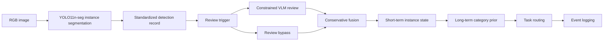

# 面向建筑废弃物机器人分拣的策略感知任务状态构建：实例分割、受约束视觉语言复核与分层动态知识图谱

> 小论文完善稿 v4  
> 建议目标期刊：Automation in Construction / Advanced Engineering Informatics / Journal of Building Engineering  
> 文章类型：方法框架 + 受控原型验证  
> 当前证据边界：二维实例分割、VLM 小批量复核、保守任务路由、软件事件追踪；不声称真实机械臂闭环、真实 RGB-D 抓取或严格 before/after 图片移除验证已完成。

## 英文题目建议

**Policy-aware task state construction for robotic construction and demolition waste sorting: Instance segmentation, constrained vision-language review, and layered dynamic knowledge graph**

备选题目：

1. **From instance segmentation to auditable task states: A constrained VLM and layered knowledge graph framework for C&D waste sorting**
2. **Converting C&D waste perception into task states through constrained VLM review and layered dynamic knowledge representation**
3. **A policy-aware perception-to-state framework for construction waste sorting using YOLO segmentation, VLM review, and dynamic knowledge graphs**

建议使用第 1 个题目。它突出本文真正的贡献是“task state construction”，而不是单纯提出一个 YOLO、VLM 或知识图谱组合。

---

## 摘要

建筑与拆除废弃物（construction and demolition waste, C&D waste）机器人分拣需要在非结构化、遮挡和潜在风险条件下识别目标，并进一步判断对象是否适合自动处理、是否需要人工复核以及状态变化是否可追溯。现有视觉识别方法通常输出类别、边界框或实例掩膜，但这些单帧感知结果难以直接支持任务路由、风险约束和可审计决策。为弥合视觉感知与任务状态之间的断裂，本文提出一种策略感知任务状态构建方法，融合 YOLO11n-seg 实例分割、受约束视觉语言模型（vision-language model, VLM）复核和分层动态知识图谱。该方法首先将实例分割结果标准化为包含类别、置信度、边界框和掩膜的检测记录；随后对低置信度或策略敏感对象触发 VLM 复核，并通过类别白名单、结构化解析和保守回退机制限制开放式模型输出风险；最后将融合结果写入长期类别层、短期实例层和事件日志层，以生成 `AUTO_CANDIDATE`、`SUPERVISED_CANDIDATE` 和 `HUMAN_REVIEW_REQUIRED` 等任务路由。实验在冻结的 11 类 C&D waste 数据集和受控原型案例上进行。YOLO11n-seg 在 890 张测试图像和 19,475 个有效实例上取得 Box mAP50-95 = 0.8437 和 Mask mAP50-95 = 0.7397。GLM-4.5V 小批量复核实验中，18 个检测目标内有 17 个触发复核，13 个获得有效结构化响应；当模型不确定或外部 API 限流时，系统保守升级为人工复核。受控路由实验在 15 个案例上取得 Policy Consistency Rate = 1.0000、Restriction Recall = 1.0000 和 Unsafe Automation Rate = 0.0000。软件事件回放实验在 32 个案例上取得 Instance Update Success Rate、Event Chain Completeness、State Version Consistency 和 Temporal Policy Consistency 均为 1.0000。结果表明，该方法能够在受控二维实验条件下将 C&D waste 视觉识别结果转化为策略感知和事件可追溯的任务状态，为后续 RGB-D 定位、机器人规划和人机协同分拣提供结构化接口。

**关键词：** 建筑与拆除废弃物；机器人分拣；实例分割；视觉语言模型；动态知识图谱；任务状态；人工复核

---

## 1. 引言

建筑拆除、装修和改造活动会产生大量建筑与拆除废弃物。与规则工业零件不同，C&D waste 通常具有材料异质、形态不规则、尺度差异大、表面破损和类别边界模糊等特征。对象之间还可能出现堆叠、遮挡和接触关系，部分材料具有易碎、尖锐、粉尘污染或疑似危险材料风险。这些特征使 C&D waste 机器人分拣不只是一个视觉识别问题，也涉及任务风险、人工复核和状态更新。

近年来，深度学习视觉模型已被用于建筑废弃物分类、目标检测、语义分割和实例分割。实例分割能够同时提供类别、位置和对象掩膜，因此比纯检测更适合作为机器人分拣前端。掩膜可支持后续深度点云提取、边界分析和候选抓取区域生成。然而，实例分割输出仍主要是感知记录。类别、置信度、边界框和掩膜不能直接表示某个对象是否允许自动处理、是否需要人工确认、是否存在高风险处理约束，也不能解释对象状态如何随复核或操作反馈变化。

视觉语言模型和知识图谱为感知结果的语义增强提供了可能。VLM 可对低置信度或容易混淆的对象进行二次复核，知识图谱可组织材料类别、风险属性、处理先验和状态事件。然而，在机器人分拣任务中，二者不能简单叠加。若 VLM 作为开放式分类器使用，可能产生类别越界、格式不稳定或过度自信判断。若知识图谱仅作为静态类别库使用，则难以表达当前场景中的实例状态和状态演化。面向自动化分拣的系统需要一个受约束、可追溯的中间层，将感知结果转换为任务状态。

本文关注的问题是：如何将 C&D waste 实例分割输出转换为可供后续机器人规划使用的策略感知任务状态。这里的任务状态不是机械臂动作命令，而是包含对象类别、置信度、复核状态、处理先验、任务路由和事件来源的结构化表示。基于这一目标，本文提出一种融合 YOLO11n-seg、受约束 VLM 复核和分层动态知识图谱的方法。

本文贡献如下：

1. 提出一种 YOLO-to-KG 结构化接口，将 C&D waste 实例分割结果转化为带有来源、版本和复核状态的短期实例节点。
2. 设计一种受类别白名单、结构化解析和保守回退机制约束的 VLM 复核流程，用于处理低置信度、策略敏感和视觉不确定对象。
3. 构建长期类别层、短期实例层和事件日志层分离的动态知识状态模型，以区分稳定处理先验、当前实例状态和状态变化过程。
4. 通过实例分割测试、VLM 小批量复核、受控路由实验和软件事件回放，验证所提出方法在受控二维条件下的可运行性、保守性和可追溯性。

---

## 2. 相关研究与研究缺口

### 2.1 C&D waste 视觉识别

C&D waste 自动识别研究主要围绕图像分类、目标检测、语义分割和实例分割展开。目标检测方法适合快速定位对象，但边界框难以表达破碎材料的不规则轮廓。语义分割能够提供像素级类别区域，但难以区分同类多个对象。实例分割同时输出对象类别、位置和掩膜，更适合作为机器人分拣中对象级状态建模的前端。

然而，视觉识别并不等于任务决策。即使模型能够检测玻璃、塑料或石膏板，系统仍需判断这些对象是否可自动处理、是否需要监督、是否存在人工复核要求，以及识别结果是否足以进入后续规划。因此，视觉模型输出需要进一步转换为任务语义，而不是直接作为执行层输入。

### 2.2 VLM 复核及其风险

VLM 能够结合图像和文本提示对目标进行描述、判断和解释。对于 C&D waste，VLM 可用于辅助处理低置信度检测、材料外观混淆和高风险对象复核。但在自动化任务中，VLM 输出存在类别越界、格式不稳定和不确定性表达不足等风险。尤其在建筑废弃物分拣中，错误自动处理玻璃、疑似危险板材或其他高风险对象可能带来安全问题。

因此，VLM 更适合作为受约束复核器，而不是开放式决策源。本文采用类别白名单、结构化解析和人工升级机制，使 VLM 在不确定或失败时触发保守回退。

### 2.3 知识图谱与动态任务状态

知识图谱能够将类别、属性、约束和事件组织为可查询结构。在机器人任务规划中，知识图谱可作为世界状态或语义记忆，为规划器提供对象属性和任务约束。然而，C&D waste 分拣中的对象状态具有动态性。对象可能因人工移除、机器人操作、遮挡变化或重新观测而改变状态。若图谱只保存静态类别知识，无法解释当前实例状态和状态变化来源。

本文将知识图谱组织为三层：长期类别层保存稳定材料先验，短期实例层保存当前对象状态，事件日志层记录观测、复核、路由和状态变化。该设计面向任务状态构建，而不是百科式知识存储。

### 2.4 研究缺口

现有研究仍存在三个核心缺口：

1. C&D waste 实例分割结果与机器人任务状态之间缺少结构化转换机制；
2. VLM 复核缺少面向安全任务的类别约束、结构化解析和失败回退；
3. 废弃物知识图谱多偏向静态类别和规则，缺少短期实例状态和事件级追溯。

本文针对这些缺口提出策略感知任务状态构建方法，并在受控原型实验中验证其可运行性和边界。

---

## 3. 方法

### 3.1 总体框架

本文方法包括四个步骤：实例分割、受约束复核、知识状态更新和任务路由。流程如下：



该框架不直接输出机械臂动作，而是输出可供后续规划读取的任务状态。任务状态包括最终类别、复核状态、任务路由、状态版本和事件来源。

### 3.2 实例分割记录标准化

YOLO11n-seg 对输入 RGB 图像进行实例分割。每个检测结果被标准化为：

```text
detection_id
image_id
class_name
yolo_confidence
bbox_2d
mask_polygon
timestamp
source
```

随后，检测记录被转换为短期实例节点：

```text
instance_id
class_name
yolo_confidence
final_class
final_confidence
bbox_2d
mask_polygon
review_status
route_decision
task_status
state_version
last_action
```

当前研究只验证二维视觉状态和策略状态。`center_xyz`、`bbox_3d`、`blocked_by`、`supports`、`grasp_candidates` 和 `safe_grasp_score` 作为后续 RGB-D 和机械臂实验接口保留，但不作为本文已验证结果。

### 3.3 受约束 VLM 复核

VLM 复核由触发策略控制：

```text
trigger = low_confidence OR policy_sensitive_class OR predefined_review_class
```

VLM 输入包括实例裁剪图、mask overlay 图、YOLO 初始类别、YOLO 置信度和允许类别白名单。输出格式被限定为：

```json
{
  "decision": "agree | change | uncertain",
  "proposed_class": "one of allowed classes",
  "confidence": 0.0,
  "requires_human_review": true,
  "reason": "short visual rationale"
}
```

系统执行三类约束：类别必须在白名单内，输出必须能被解析，结果不得违反保守安全规则。融合规则如下：

| VLM 输出 | 系统处理 |
|---|---|
| `agree` | 保留 YOLO 类别并记录复核通过 |
| `change` 且类别合法 | 采用 VLM 建议类别并记录类别变化 |
| `uncertain` | 保留 YOLO 类别并升级人工复核 |
| API、限流、解析错误 | 保留 YOLO 类别并升级人工复核 |

### 3.4 分层动态知识状态

本文知识状态由三层组成。

长期类别层保存稳定类别先验，包括风险等级、易碎性、污染风险、默认处理方式、是否建议 VLM 复核和是否允许自动处理。本文视觉输出类别包括：

```text
concrete, brick, tile, wood, gypsum_board, foam,
metal, soft_plastic, hard_plastic, paperboard, glass
```

`asbestos_suspect` 被保留为知识层中的高风险人工复核标签，不作为普通视觉输出类别。这样可以避免将 RGB 图像识别误写为专业石棉检测结论。

短期实例层保存当前图像或场景中的对象实例，包括类别、置信度、掩膜、复核状态、任务状态和路由结果。

事件日志层记录状态变化过程，包括 `OBSERVED`、`REVIEWED`、`POLICY_PROJECTED`、`ROUTED`、`REMOVED`、`REAPPEARED` 和 `REVIEW_ERROR_FALLBACK` 等事件。

### 3.5 保守任务路由

任务路由包括：

```text
AUTO_CANDIDATE
SUPERVISED_CANDIDATE
HUMAN_REVIEW_REQUIRED
```

若复核状态为不确定、接口错误或人工复核要求，则进入 `HUMAN_REVIEW_REQUIRED`。若长期类别先验要求 `human_review` 或 `human_only`，则不进入自动处理候选。若类别允许机器人处理但建议监督，则进入 `SUPERVISED_CANDIDATE`。只有当类别、置信度和复核状态均满足规则时，实例才进入 `AUTO_CANDIDATE`。

---

## 4. 实验设计

### 4.1 验证目标

实验围绕四个问题展开：

1. 实例分割模型能否提供可用的二维对象输入？
2. 受约束 VLM 复核链路能否处理视觉证据并在失败时保守回退？
3. 分层知识状态能否将对象实例投影为一致的任务路由？
4. 事件日志能否维护状态版本和状态变化链？

### 4.2 数据与类别

本文冻结 11 类视觉输出类别：

```text
concrete, brick, tile, wood, gypsum_board, foam,
metal, soft_plastic, hard_plastic, paperboard, glass
```

`asbestos_suspect` 不作为视觉模型输出类别，而作为长期知识层中的高风险人工复核标签。这一处理避免将 RGB 图像识别误写为专业材料检测结论。

### 4.3 模型与环境

实例分割模型采用 YOLO11n-seg。选择轻量模型的原因是当前研究处于原型阶段，需要在 8 GB 显存笔记本 GPU 上进行多轮迭代。训练和推理环境为 Windows 11 x64，GPU 为 NVIDIA GeForce RTX 5060 Laptop GPU，显存约 8 GB。

VLM 复核采用 GLM-4.5V，接口配置为：

```text
LLM_BASE_URL=https://api.siliconflow.cn/v1
LLM_MODEL=zai-org/GLM-4.5V
LLM_RESPONSE_FORMAT_JSON=false
```

由于接口不支持强制 JSON mode，本文通过 prompt 约束输出结构，并在本地执行解析、白名单校验和失败回退。

### 4.4 评价指标

实例分割采用 Box mAP50-95 和 Mask mAP50-95。VLM 复核采用复核覆盖率、有效响应率、人工复核率、决策分布和平均延迟。任务路由采用 Policy Consistency Rate、Restriction Recall、Unsafe Automation Rate、Over-conservative Rate 和 Human Escalation Rate。事件追踪采用 Instance Update Success Rate、Event Chain Completeness、State Version Consistency 和 Temporal Policy Consistency。

---

## 5. 结果

### 5.1 实例分割整体性能

YOLO11n-seg 在独立测试集上评估。测试集包含 890 张图像和 19,475 个有效实例。整体结果如下：

| 指标 | 数值 |
|---|---:|
| test images | 890 |
| test effective instances | 19,475 |
| Box precision | 0.9426 |
| Box recall | 0.8964 |
| Box mAP50 | 0.9434 |
| Box mAP50-95 | 0.8437 |
| Mask precision | 0.9428 |
| Mask recall | 0.8908 |
| Mask mAP50 | 0.9363 |
| Mask mAP50-95 | 0.7397 |

结果表明，YOLO11n-seg 可为知识状态构建提供二维实例分割输入。该结论限于二维视觉层面，不代表三维定位或机械臂执行已经验证。

### 5.2 实例分割类别级性能

类别级结果如下。表中 `instances` 表示测试集中该类别有效实例数量。

| 类别 | instances | Box P | Box R | Box mAP50-95 | Mask P | Mask R | Mask mAP50-95 |
|---|---:|---:|---:|---:|---:|---:|---:|
| concrete | 6,893 | 0.9490 | 0.9358 | 0.8516 | 0.9450 | 0.9272 | 0.7340 |
| brick | 257 | 0.9882 | 0.9749 | 0.9469 | 0.9921 | 0.9722 | 0.8392 |
| tile | 235 | 0.9655 | 0.9574 | 0.9569 | 0.9702 | 0.9574 | 0.8305 |
| wood | 2,205 | 0.9485 | 0.8762 | 0.8437 | 0.9519 | 0.8713 | 0.7502 |
| gypsum_board | 218 | 0.9291 | 0.9083 | 0.8644 | 0.9293 | 0.9047 | 0.8054 |
| foam | 142 | 0.9101 | 0.9085 | 0.9006 | 0.9075 | 0.8980 | 0.8482 |
| metal | 3,666 | 0.9295 | 0.8092 | 0.7381 | 0.9216 | 0.7919 | 0.5239 |
| soft_plastic | 872 | 0.9133 | 0.7626 | 0.7061 | 0.9184 | 0.7603 | 0.6380 |
| hard_plastic | 3,594 | 0.9490 | 0.8851 | 0.8404 | 0.9490 | 0.8801 | 0.6954 |
| paperboard | 980 | 0.8989 | 0.8614 | 0.8189 | 0.9026 | 0.8602 | 0.7454 |
| glass | 413 | 0.9878 | 0.9815 | 0.8134 | 0.9837 | 0.9758 | 0.7264 |

从类别级结果看，`metal`、`soft_plastic` 和 `hard_plastic` 的 Mask mAP50-95 相对较低，说明复杂边界、反光材质、遮挡和材料形态差异仍会影响掩膜质量。由于本文后续任务状态依赖类别和掩膜，因此这些类别更适合触发 VLM 复核或人工监督，而不应直接进入无监督自动处理。

### 5.3 VLM 复核与回退

单图测试中，YOLO 将目标识别为 `hard_plastic`，置信度为 0.9547；GLM-4.5V 返回 `uncertain`；系统保留 YOLO 类别并将 `review_status` 设置为 `human_review_required`。该结果验证了不确定条件下的保守回退逻辑。

20 图小批量复核结果如下：

| 指标 | 数值 |
|---|---:|
| image_count | 20 |
| detection_count | 18 |
| reviewed_count | 17 |
| review_coverage | 0.9444 |
| valid_vlm_response_count | 13 |
| valid_vlm_response_rate | 0.7647 |
| human_review_required_count | 9 |
| human_review_required_rate | 0.5000 |
| mean_latency_seconds | 8.4690 |
| agree | 8 |
| change | 0 |
| uncertain | 5 |
| review_error | 4 |
| not_reviewed | 1 |

4 个 `review_error` 均来自 `HTTP 429 TPM limit reached`。因此，当前限制主要来自外部模型服务配额，而不是本地解析或图谱更新逻辑。该结果支持 VLM 复核链路的小批量可运行性，但不支持“VLM 已显著提升完整测试集准确率”的结论。本文应将该实验表述为 constrained VLM review and fallback validation，而不是 YOLO-only 与 YOLO+VLM 的完整精度对比实验。

### 5.4 保守任务路由

受控路由实验包含 15 个案例。结果如下：

| 指标 | 数值 |
|---|---:|
| case_count | 15 |
| Policy Consistency Rate | 1.0000 |
| Restriction Recall | 1.0000 |
| Unsafe Automation Rate | 0.0000 |
| Over-conservative Rate | 0.0000 |
| Human Escalation Rate | 0.5333 |

结果显示，在当前受控案例和保守策略库中，敏感类别、低置信度和复核异常对象不会被直接路由为自动处理候选。该实验验证的是动作前任务语义路由，不是机械臂真实执行。

### 5.5 事件追踪与状态一致性

软件事件回放覆盖 32 个受控案例，包括正常确认、VLM 纠错、VLM 不确定回退、低置信度人工复核、敏感类别复核、对象移除、对象重新出现和 API/schema 异常回退。结果如下：

| 指标 | 数值 |
|---|---:|
| case_count | 32 |
| Instance Update Success Rate | 1.0000 |
| Event Chain Completeness | 1.0000 |
| State Version Consistency | 1.0000 |
| Temporal Policy Consistency | 1.0000 |

结果表明，当前软件原型能够维护状态版本、事件链完整性和跨时间策略一致性。该结果证明的是软件事件追踪能力，而非真实机械臂执行或严格图片移除再感知。

### 5.6 严格图片序列审查

项目额外审查了 before/after 图片序列候选。可用于论文正文的图片对必须满足固定相机、固定背景、仅移除一个对象、其他对象位置和形态基本不变、后图无新增对象等条件。现有候选图多数存在物体替换、摆放变化、视角变化或被移除对象过小等问题，不能作为正式证据。因此，严格图片序列再感知仍需后续补拍。

---

## 6. 讨论

### 6.1 感知到任务状态的转换价值

本文结果表明，C&D waste 分拣前端不能仅依赖实例分割指标。机器人系统需要将视觉输出转换为包含复核状态、处理约束和任务路由的结构化状态。所提出的 YOLO-to-KG 接口和分层知识状态为这一转换提供了实现路径。

这一结果对建筑自动化研究具有方法意义。许多视觉模型能够输出较高的 mAP，但 mAP 本身并不能说明对象是否适合自动处理。对于机器人分拣，系统还需要回答“该对象是否危险”“是否需要人工复核”“识别依据来自哪里”“状态何时发生变化”等问题。本文的任务状态构建方法正是面向这些问题设计。

### 6.2 VLM 作为受约束复核器

VLM 在本文中不是独立分类器，而是受约束复核器。E2 结果显示，VLM 可以处理 crop 和 mask overlay 证据，但也会返回不确定结果或遭遇 API 限流。因此，保守回退和人工升级机制是该模块能够进入机器人任务链的前提。

这一设计避免了两个风险：一是直接信任开放式模型输出导致类别越界或误分类；二是在模型失败时中断整个任务状态构建流程。本文采用的策略是：VLM 可以提供复核意见，但不能绕过类别白名单、解析校验和长期知识层中的安全约束。

### 6.3 动态知识图谱的职责边界

长期类别层、短期实例层和事件日志层分别承担稳定先验、当前状态和过程记录。该分层设计避免将静态知识与实时观测混合，也为后续规划器查询对象状态、人工复核原因和事件来源提供基础。

需要强调的是，本文当前验证的是分层动态知识状态原型，而不是完整物理动态场景闭环。事件回放验证了状态记录和版本一致性，但还没有证明机械臂执行后真实场景被重新观测并更新。因此，本文对“dynamic”的使用应限定在状态表示和事件追踪层面，而不是扩展为真实动态物理环境验证。

### 6.4 当前验证边界

本文验证的是受控二维条件下的任务状态构建。真实机器人闭环仍需要 RGB-D 三维定位、相机到机械臂基座的外参标定、运动规划、执行反馈和再感知。本文方法可作为这些后续模块的状态接口，但当前实验不构成现场部署或真实抓取验证。

---

## 7. 局限性

本文存在以下局限。

第一，实验仍限于二维视觉和软件状态验证，尚未接入 RealSense D435i 在线深度图、三维定位和空间关系推断。

第二，VLM 复核仍为小批量验证，受外部 API token 配额限制，尚未覆盖完整测试集，也尚未形成 YOLO-only 与 YOLO+VLM 的完整精度对比。

第三，路由实验基于受控案例，验证的是规则一致性，不证明视觉模型不会误检，也不证明机械臂执行安全。

第四，事件追踪实验是软件回放，尚未获得严格 before/after 图片再感知证据。现有候选图片经重新审查后不能作为正式论文证据。

第五，`asbestos_suspect` 仅作为高风险人工复核标签，不能替代专业材料检测。

---

## 8. 结论

本文提出一种面向 C&D waste 机器人分拣任务状态构建的方法，融合 YOLO11n-seg 实例分割、受约束 VLM 复核和分层动态知识图谱。该方法将二维视觉识别结果转化为带有复核状态、处理先验、任务路由和事件日志的可审计状态。

实验结果显示，YOLO11n-seg 在 890 张测试图像和 19,475 个有效实例上取得 Box mAP50-95 = 0.8437 和 Mask mAP50-95 = 0.7397；GLM-4.5V 小批量复核实验获得 13/17 的有效结构化响应，并能够在不确定或限流时触发人工复核；受控路由实验取得 Policy Consistency Rate = 1.0000、Restriction Recall = 1.0000 和 Unsafe Automation Rate = 0.0000；软件事件回放取得四项状态追踪指标均为 1.0000。这些结果表明，所提出方法能够在受控二维实验条件下支持策略感知和事件可追溯的任务状态构建。

未来工作将优先补拍严格 before/after 图片序列，以验证人工移除后的图像再感知和状态更新；随后接入 RealSense D435i，生成三维实例坐标和空间关系；最后在 ROS2/MoveIt2 环境中开展低风险类别机械臂空跑和实体抓取实验，并将执行反馈写入事件日志。

---

## 9. 建议图表清单

| 编号 | 图表内容 | 当前状态 | 证据位置 |
|---|---|---|---|
| Fig. 1 | 系统总体框架 | 可绘制 | 本文方法第 3.1 节 |
| Fig. 2 | 长期类别层、短期实例层、事件日志层 | 可绘制 | `docs/knowledge_seed_zh.md` |
| Fig. 3 | VLM 受约束复核流程 | 可绘制 | `wastekg/llm_reviewer.py` 与 E2 输出 |
| Fig. 4 | YOLO 验证预测、混淆矩阵和 Mask PR 曲线 | 已有图片 | `artifacts/e1_test_evaluation_r2/ultralytics/metrics` |
| Fig. 5 | 典型分割案例 | 已有初步图片 | `artifacts/e1_qualitative_samples_r1` |
| Fig. 6 | E2 VLM 三联图：prediction / crop / mask overlay | 已有图片 | `artifacts/paper/e2_vlm_glm45v_batch20_r3_focused/images/001_cdw2026_2022_0345` |
| Fig. 7 | E3 保守路由流程 | 可绘制 | `artifacts/paper/e3_policy_routing` |
| Fig. 8 | E4 controlled event replay chain | 可绘制 | `artifacts/paper/e4_event_replay` |
| Table 1 | 数据集 split 与类别分布 | 需补完整 train/val | `datasets/waste11_grouped_v1` |
| Table 2 | 模型与环境配置 | 已有信息 | `artifacts/e1_test_evaluation_r2/evaluation_manifest.json` |
| Table 3 | 长期知识层策略表 | 需从代码核对 | `wastekg/knowledge_base.py` |
| Table 4 | YOLO 类别级指标 | 已整理在本文 | `artifacts/e1_test_evaluation_r2/per_class_metrics.csv` |
| Table 5 | VLM 复核结果 | 已整理在本文 | `artifacts/paper/e2_vlm_glm45v_batch20_r3_focused/e2_vlm_batch_summary.json` |
| Table 6 | E3 路由案例与指标 | 指标已有，案例表需精选 | `artifacts/paper/e3_policy_routing` |
| Table 7 | E4 软件事件回放指标 | 已整理在本文 | `artifacts/paper/e4_event_replay` |

---

## 10. 投稿前必须补齐的内容

1. **参考文献**：补齐 C&D waste 识别、实例分割、VLM 复核、知识图谱和机器人任务规划相关文献。不要使用占位引用投稿。
2. **数据集统计表**：补全 train/val/test 图像数、实例数和每类实例分布。
3. **混淆矩阵分析**：从 `confusion_matrix_normalized.png` 中提取最严重混淆对，并配代表图。
4. **E2 图像证据图**：制作三联图，展示 YOLO 预测、VLM crop、mask overlay。
5. **E3 典型路由案例表**：覆盖 `AUTO_CANDIDATE`、`SUPERVISED_CANDIDATE` 和 `HUMAN_REVIEW_REQUIRED`。
6. **E4 事件链图**：明确写成 controlled software event replay，不写成真实机械臂执行。
7. **严格 before/after 图片**：若要强化动态性，需要后续补拍 5-10 组固定视角图片。

---

## 11. 当前最需要避免的过度表述

不建议写：

```text
本文实现了完整建筑废弃物机器人自主分拣系统。
```

建议写：

```text
本文实现并验证了一个受控原型，用于将 C&D waste 二维实例分割结果转换为策略感知和可审计的任务状态。
```

不建议写：

```text
VLM 显著提高了建筑废弃物识别准确率。
```

建议写：

```text
VLM 小批量实验验证了受约束复核和失败回退链路的可运行性，但尚未构成完整准确率提升实验。
```

不建议写：

```text
E4 验证了真实移除后的图像再感知。
```

建议写：

```text
E4 当前验证了软件事件追踪和状态一致性；严格图片再感知仍需补拍 before/after 样本。
```

---

## 12. 证据文件索引

```text
E1 overall metrics:
artifacts/e1_test_evaluation_r2/overall_metrics.json

E1 per-class metrics:
artifacts/e1_test_evaluation_r2/per_class_metrics.csv

E1 qualitative samples:
artifacts/e1_qualitative_samples_r1

E2 VLM batch summary:
artifacts/paper/e2_vlm_glm45v_batch20_r3_focused/e2_vlm_batch_summary.json

E2 VLM visual evidence:
artifacts/paper/e2_vlm_glm45v_batch20_r3_focused/images/001_cdw2026_2022_0345

E3 policy routing:
artifacts/paper/e3_policy_routing

E4 software event replay:
artifacts/paper/e4_event_replay

E4 strict removal candidate audit:
paper_experiments/docs/e4_strict_removal_audit_summary_zh.md
artifacts/paper/e4_image_sequence_candidates/strict_removal_candidate_audit.md
```

---

## 13. 本版相对上一版的主要完善

1. 纠正 E2 平均耗时为 `8.4690 s/target`，与当前结果文件一致。
2. 纳入 YOLO 类别级指标，避免只报告总体 mAP。
3. 明确 `metal`、`soft_plastic` 和 `hard_plastic` 等类别的掩膜性能边界。
4. 将 E4 图片序列从“已完成证据”改为“严格审查后仍需补拍”，避免过度主张。
5. 强化论文主线：从实例分割输出到策略感知任务状态，而不是泛泛堆叠 YOLO、VLM 和图谱。
6. 将多智能体、ROS2、RealSense 和机械臂闭环严格放入未来工作。

