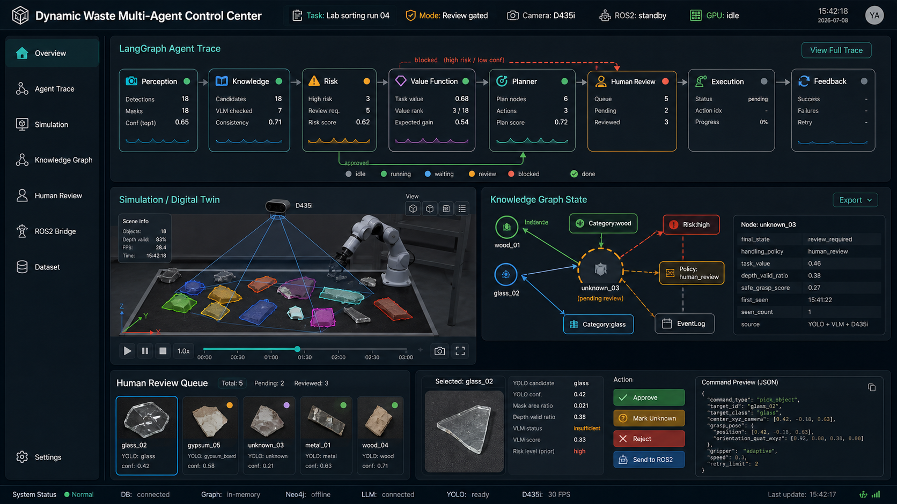

# UI 概念设计 v1

本文档说明 `dynamic-waste-ui` 第一版界面概念。该版本只用于确认信息结构和交互方向，不表示系统已经完成真实 ROS2 闭环、仿真接入或机械臂执行验证。



## 1. 设计目标

界面目标不是展示单个模型结果，而是展示完整任务闭环：

```text
YOLO / RealSense / VLM
  -> 知识图谱状态更新
  -> LangGraph 多智能体决策
  -> 人工复核
  -> ROS2 / 仿真执行请求
  -> 执行反馈回写
```

第一版 UI 需要同时回答四个问题：

```text
系统现在看到了什么？
知识图谱为什么这样判断？
规划器下一步想做什么？
哪些动作必须由人确认？
```

## 2. 总体布局

界面采用工作台式布局，而不是首页式布局：

```text
左侧导航
顶部状态栏
中部 Agent Trace
中下部仿真 / 数字孪生视图
右侧知识图谱状态
底部人工复核队列
```

这种布局的好处是能同时查看 agent 推理链、对象状态、图谱证据、仿真占位和人工决策入口，适合后续做实验记录和系统调试。

## 3. 区域说明

### 3.1 左侧导航

导航只放主工作区入口：

```text
Overview
Agent Trace
Simulation
Knowledge Graph
Human Review
ROS2 Bridge
Dataset
```

后续真正开发时，不建议把论文实验、训练日志和数据清洗脚本都塞进前端导航。前端只承载运行时观察、人工复核和调试入口。

### 3.2 顶部状态栏

顶部状态栏显示当前运行上下文：

```text
Task: Lab sorting run 04
Mode: Review gated
Camera: D435i
ROS2: standby
GPU: idle
```

这些状态用于提醒用户当前系统是否处于人工门控、是否有 ROS2 连接、是否正在使用相机或 GPU。涉及训练时仍遵循项目规则：界面可以显示训练指令和显存检查提示，但不在沙盒中直接启动训练。

### 3.3 LangGraph Agent Trace

该区域参考 LangSmith 类 trace 视图，展示多智能体信息流：

```text
Perception
  -> Knowledge
  -> Risk
  -> Value Function
  -> Planner
  -> Human Review / Execution
  -> Feedback
```

关键边界必须清楚：

```text
价值函数：判断什么值得做。
图谱状态：判断现在能不能做。
规划器：判断先做什么、后做什么、失败后怎么办。
```

界面上应该允许用户看到每个节点的输入、输出、状态和失败原因，但不要把 prompt 长文本直接铺满主界面。长文本应进入详情抽屉或日志页。

### 3.4 Simulation / Digital Twin

该区域是后续仿真和离线回放入口。第一阶段可以先显示：

```text
实验台场景
D435i 相机视锥
PiPER 或机械臂占位模型
YOLO mask / bbox 叠加
对象中心点和深度有效率
回放时间轴
```

当前不能在文档或 UI 中声称已经完成真实机械臂抓取闭环。后续可接入 Gazebo、Isaac Sim、Foxglove 或自定义 WebGL 视图。

### 3.5 Knowledge Graph State

该区域展示当前对象在知识图谱中的状态，而不是显示百科式大图谱。

建议展示节点：

```text
Instance: wood_01
Instance: glass_02
Instance: unknown_03
Category: wood
Category: glass
Risk: high
Policy: human_review
EventLog
```

右侧属性检查器建议固定显示：

```text
final_state
handling_policy
task_value
depth_valid_ratio
safe_grasp_score
requires_human_review
failure_count
```

注意：`task_value` 只能表示对象值得关注，不表示可以自动抓取。自动抓取仍必须检查 `known_candidate`、`auto_grasp`、深度有效率、抓取评分和失败次数。

### 3.6 Human Review Queue

底部人工复核队列用于处理低置信度、高风险、VLM 冲突和 unknown 对象。

典型对象卡片包含：

```text
object_id
YOLO candidate
yolo_confidence
VLM consistency status
risk_level
handling_policy
crop / mask preview
```

操作按钮建议保留四类：

```text
Approve
Mark Unknown
Reject
Send to ROS2
```

`Send to ROS2` 必须只在对象满足门控条件时可用。按钮触发的不是自由文本，而是结构化命令预览。

## 4. 推荐前端数据模型

第一阶段可以使用 mock 数据驱动 UI。建议从 `dynamic-waste-agent` 和 `dynamic-waste-kg` 的结构化输出对齐字段：

```json
{
  "run_id": "lab_run_04",
  "mode": "review_gated",
  "agent_trace": [],
  "instances": [],
  "kg_nodes": [],
  "kg_edges": [],
  "human_review_queue": [],
  "ros2_command_preview": null,
  "simulation_state": {
    "source": "placeholder",
    "frame_id": "camera_color_optical_frame"
  }
}
```

前端不要自己发明一套和后端不同的语义。字段应尽量复用：

```text
final_state
handling_policy
requires_human_review
vlm_consistency_status
depth_valid_ratio
safe_grasp_score
task_value
```

## 5. 后续实现顺序

建议按以下顺序落地：

```text
1. 静态 React 工作台页面
2. mock 数据驱动的 Agent Trace 与 KG 面板
3. 人工复核队列和结构化命令预览
4. 接入 dynamic-waste-agent 的 LangGraph 状态输出
5. 接入 dynamic-waste-kg 的实例记忆和事件日志
6. 接入仿真或离线回放
7. 最后再接 ROS2 bridge
```

这个顺序可以避免在界面还没稳定时过早碰真实机械臂，也能先把信息流和人工门控逻辑验证清楚。
